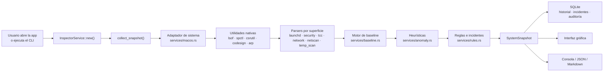

# 01 · Descripción general del sistema

> Qué es RootCause macOS Inspector, qué problema resuelve, quién lo usa y cómo funciona a
> grandes rasgos. Es el documento de entrada: si solo vas a leer uno, lee este.

---

## 1. Qué es

RootCause macOS Inspector es una **aplicación de escritorio y de línea de comandos para
macOS, escrita en Rust**, que observa el estado de seguridad y de recursos del equipo y
explica con evidencia por qué algo merece atención.

La idea que le da sentido cabe en una frase, y está escrita en el `README.md` del
repositorio: *cualquier distorsión anómala de los recursos o de la configuración de un
equipo puede ser el primer indicio de que algo está ocurriendo.* No solo lentitud: también
un LaunchDaemon que apareció anoche, Gatekeeper apagado, una aplicación con Acceso total al
disco que nadie recuerda haber autorizado, un binario sin firmar hablando con cuatro
destinos públicos o un equipo desconocido en el segmento de red.

El producto se declara explícitamente como **sensor forense y de apoyo a la decisión**, no
como antivirus ni como EDR: no elimina malware ni bloquea por firma
(`src/services/report.rs`, sección «Limitaciones de esta captura»).

## 2. Qué problema resuelve

macOS tiene las respuestas repartidas entre `spctl`, `csrutil`, `fdesetup`,
`socketfilterfw`, Ajustes del Sistema, `launchctl`, `lsof` y una base SQLite no
documentada (`TCC.db`). Ninguna vista del sistema las reúne, y ninguna dice **qué cambió
desde ayer**.

| Pregunta que el sistema no responde de una vez | Cómo la responde RootCause | Módulo |
|---|---|---|
| ¿Qué se ejecuta al arrancar y no puse yo? | Inventario de las cinco carpetas de launchd, `cron` y login items, con estado vs baseline | `services/launchd.rs` |
| ¿Gatekeeper, SIP y FileVault siguen activos? | Consulta directa con la salida cruda del comando como evidencia | `services/security.rs` |
| ¿Qué app puede leer todo mi disco o mi teclado? | Lectura de ambas bases TCC, con severidad por servicio | `services/tcc.rs` |
| ¿Están al día las firmas de XProtect? | Versión y antigüedad de cada bundle de definiciones de Apple | `services/security.rs` |
| ¿Qué proceso habla con Internet y desde qué ruta? | `lsof -i` en modo campo + verificación de firma con `codesign` | `services/network.rs`, `services/macos.rs` |
| ¿Hay algún equipo nuevo en mi red? | Vecinos ARP contra una baseline de «red conocida» | `services/netscan.rs` |
| ¿Qué carpeta se comió el disco? | Medición acotada de cachés y limpieza segura de dos pasos | `services/temp_scan.rs` |
| ¿Qué cambió desde la última vez? | Motor genérico de comparación contra baseline | `services/baseline.rs` |

## 3. A quién está dirigido

| Perfil | Uso principal |
|---|---|
| **Usuario técnico de macOS** | Revisión periódica del equipo propio: qué arranca, qué permisos hay concedidos, qué cambió |
| **Analista de seguridad / respuesta a incidentes** | Captura de evidencia reproducible de un Mac sospechoso, exportable en JSON y en Markdown |
| **Administrador de una flota pequeña** | Verificación de que los controles nativos siguen encendidos y de que XProtect se actualiza |
| **Desarrollador** | Diagnóstico de consumo y de procesos propios; edición CLI-only integrable en scripts |
| **Auditor** | Reporte forense con evidencia textual del comando que respondió cada control |

## 4. Casos de uso principales

1. **Diagnóstico rápido de un Mac.** `rootcause status` imprime veredicto, controles de
   seguridad, antigüedad de XProtect, entradas de persistencia con cambios, estado de TCC,
   contexto de ejecución y alertas priorizadas.
2. **Vigilancia continua con la interfaz gráfica.** La app refresca cada `refresh_interval_secs`
   segundos (5 por defecto) y mantiene el semáforo, las tendencias y las alertas al día.
3. **Investigación de un cambio.** Cuando aparece una entrada de persistencia nueva, la
   sección Persistencia muestra el plist, el binario, su firma y el motivo del riesgo, y
   ofrece revelarlo en el Finder.
4. **Recolección de evidencia.** `rootcause report` genera un Markdown fechado en
   `~/Documents/RootCause/reports/`; `rootcause export` vuelca la captura completa a JSON.
5. **Comprobación de red.** `rootcause network` lista los vecinos del segmento; `--deep`
   hace un barrido activo y resuelve nombres.
6. **Higiene de almacenamiento.** `rootcause clean-caches` simula por defecto y solo borra
   con `--yes`, limitado a `~/Library/Caches` y a lo no usado en 24 horas.

## 5. Funcionalidades principales

### 5.1 Las siete superficies observadas

| # | Superficie | Qué observa | Baseline |
|---|---|---|---|
| 1 | **Persistencia** | LaunchAgents, LaunchDaemons, login items, `cron` | Sí |
| 2 | **Procesos** | CPU, memoria, E/S, usuario, línea de comandos, firma de código | No |
| 3 | **Controles de seguridad** | Gatekeeper, SIP, FileVault, firewall, modo encubierto, SSH | Sí |
| 4 | **Antimalware de Apple** | XProtect, XProtect Remediator, MRT: versión y antigüedad | No |
| 5 | **Privacidad (TCC)** | Permisos concedidos, con severidad por servicio | Sí (solo sensibles) |
| 6 | **Red** | Conexiones por proceso, puertos expuestos, vecinos del segmento | Sí (vecinos) |
| 7 | **Almacenamiento** | Cachés y temporales medidos por raíz, limpieza segura | No |

### 5.2 Motor de detección

- **Heurísticas de comportamiento** (`services/anomaly.rs`): CPU sostenido, crecimiento de
  memoria, escritura agresiva, tráfico saliente inusual, barrido de la red local, ruta de
  ejecución sospechosa, binario sin firma y reaparición rápida de procesos.
- **Motor de baseline** (`services/baseline.rs`): clasifica cada ítem vigilado como
  `Added`, `Modified`, `Removed` o `Unchanged` respecto al «estado bueno conocido».
- **Reglas e incidentes** (`services/rules.rs`): convierten señales en alertas priorizadas
  y derivan un incidente resumido con causas probables, acciones sugeridas y evidencia.

### 5.3 Salidas

| Salida | Formato | Dónde |
|---|---|---|
| Interfaz gráfica | 12 secciones egui | Ventana de la app |
| Consola | Texto tabulado | `stdout` |
| Captura completa | JSON | `~/Downloads` o `~/Documents` |
| Reporte forense | Markdown | `~/Documents/RootCause/reports/` |
| Historial | SQLite | `~/Library/Application Support/RootCauseInspector/rootcause-history.db` |
| Copia del historial | JSON | Junto al SQLite |

## 6. Actores y tipos de usuario

El producto **no tiene sistema de cuentas, roles ni autenticación propia**: se apoya
íntegramente en el modelo de permisos de macOS. Los «actores» relevantes son:

| Actor | Qué puede hacer | Cómo se determina |
|---|---|---|
| Usuario que ejecuta el binario | Todo lo que su UID permita | `macos::current_user`, `macos::current_uid` |
| Usuario con privilegios de root | Además, ver los sockets de todos los procesos | `macos::is_root` |
| Aplicación con Acceso total al disco | Además, leer `TCC.db` y auditar permisos | `tcc::scan` → `TccOverview::full_disk_access` |
| Aplicación con permiso de Automatización | Además, consultar login items | `launchd::login_items` |

Cuando falta un permiso, el sistema **lo declara** en vez de mostrar una lista vacía: es una
decisión de diseño explícita en `services/tcc.rs` y en `rules.rs` (alerta «Permisos de
privacidad no legibles»).

## 7. Flujo general de funcionamiento

Lectura del diagrama: **todo parte de una captura**. El servicio de inspección pide datos
al adaptador de sistema, que ejecuta utilidades nativas de macOS; cada parser convierte esa
salida en modelos de dominio; el motor de baseline marca lo que cambió; las heurísticas
añaden señales de comportamiento; las reglas ordenan todo en alertas y, si procede, derivan
un incidente. El resultado es un `SystemSnapshot` único que alimenta a la vez la interfaz,
la consola, los exportes y el historial. Ninguna capa posterior vuelve a consultar el
sistema operativo.

## 8. Entradas y salidas

### 8.1 Entradas

| Entrada | Origen | Uso |
|---|---|---|
| Salida de utilidades de macOS | `Command` sobre binarios de rutas absolutas | Toda la recolección |
| Archivos `.plist` de launchd | Cinco carpetas conocidas | Persistencia |
| `TCC.db` (usuario y sistema) | SQLite en solo lectura | Privacidad |
| `rootcause-config.json` | `~/Library/Application Support/RootCauseInspector/` | Umbrales y política |
| Baselines previas | SQLite propio | Detección de cambios |
| Argumentos de línea de comandos | `std::env::args` | Modo CLI |
| Variable de entorno de la clave IA | Nombre configurable, `ROOTCAUSE_AI_API_KEY` por defecto | IA opcional |

### 8.2 Salidas

Además de las de la sección 5.3, el sistema puede producir:

- **Una notificación del sistema** cuando la captura trae una alerta crítica y
  `alerting.notify_on_critical` está activo (`macos::notify` vía `osascript`).
- **Una petición HTTPS al proveedor IA configurado**, solo si `ai.enabled = true`, hay
  `ai.endpoint` y existe la variable de entorno con la clave. Viaja únicamente el incidente
  ya resumido.

## 9. Componentes más importantes

| Componente | Archivo | Responsabilidad |
|---|---|---|
| Punto de entrada | `src/main.rs` | Decide CLI o GUI y arranca la ventana |
| Motor de inspección | `src/services/inspector.rs` | Orquesta la captura y expone las acciones |
| Adaptador de sistema | `src/services/macos.rs` | Único punto que habla con macOS |
| Modelos de dominio | `src/models.rs` | 33 tipos serializables compartidos por todo |
| Reglas | `src/services/rules.rs` | Clasificación, alertas e incidentes |
| Baseline | `src/services/baseline.rs` | Motor genérico de cambios |
| Persistencia | `src/services/persistence.rs` | SQLite: historial, incidentes, auditoría, baselines |
| Interfaz | `src/app.rs` | 12 secciones egui sobre un hilo de trabajo |
| CLI | `src/cli.rs` | 19 comandos, casi todos con `--json` |

## 10. Tecnologías utilizadas

| Tecnología | Versión declarada | Para qué |
|---|---|---|
| Rust | edición 2021, mínimo 1.82 | Todo el producto |
| `eframe` / `egui` | 0.29 (opcional, feature `gui`) | Interfaz gráfica |
| `rusqlite` | 0.32 con `bundled` | Historial propio y lectura de `TCC.db` |
| `sysinfo` | 0.32 (`system`, `network`) | Procesos, memoria, CPU, interfaces |
| `plist` | 1 | Lectura de plists de launchd y de XProtect |
| `serde` / `serde_json` | 1 | Serialización de modelos y configuración |
| `chrono` | 0.4 | Marcas de tiempo UTC y formatos RFC 3339 |
| `walkdir` | 2.5 | Medición acotada de cachés |
| `dirs` | 5 | Rutas de datos del usuario |
| `anyhow` | 1 | Errores con contexto |

No hay cliente HTTP entre las dependencias: la única petición de red posible se hace con
`curl`, que viene con macOS (`src/services/ai.rs`).

## 11. Dependencias del sistema operativo

El producto depende de utilidades que macOS trae de fábrica. `macos::environment` las
declara y avisa si falta alguna:

`/usr/sbin/lsof`, `/usr/sbin/spctl`, `/usr/bin/csrutil`, `/usr/bin/fdesetup`,
`/usr/bin/codesign`, `/usr/sbin/arp`, `/bin/launchctl`. Además usa `/bin/ps`, `/sbin/route`,
`/sbin/ifconfig`, `/sbin/ping`, `/usr/bin/dscacheutil`, `/usr/bin/log`, `/usr/bin/osascript`,
`/usr/bin/open`, `/usr/bin/defaults`, `/usr/sbin/sysctl`, `/usr/bin/sw_vers`, `/usr/bin/id`,
`/bin/kill`, `/usr/bin/crontab`, `/usr/libexec/ApplicationFirewall/socketfilterfw` y
`/usr/bin/curl`.

## 12. Límites del sistema

Declarados por el propio producto en `README.md`, en `docs/LIMITACIONES.md` y en el reporte
generado:

- No se entrega binario precompilado firmado ni notarizado por Apple.
- Sin **Acceso total al disco**, la sección de privacidad no puede leer `TCC.db`.
- Sin privilegios de root, `lsof` solo ve los sockets del propio usuario.
- El escaneo de cachés es acotado (40 000 entradas por raíz); no indexa el disco completo.
- Los vecinos ARP no equivalen a un IDS ni a un análisis forense de red.
- RootCause **no elimina malware**: señala dónde mirar y deja evidencia.
- `block-ip` **no aplica** reglas de firewall: entrega el comando `pfctl` exacto.
- XProtect solo compara contra firmas conocidas de Apple; no detecta amenazas nuevas.
- TCC registra el permiso, no su uso.

## 13. Integraciones externas

| Integración | Estado | Detalle |
|---|---|---|
| Proveedor IA compatible con la API de chat de OpenAI | **Opcional y apagado por defecto** | `src/services/ai.rs`; requiere endpoint y clave en variable de entorno |
| GitHub Actions | Activo | CI, release y despliegue de la landing |
| Homebrew (cask) | Plantilla | `packaging/homebrew/rootcause.rb`, sin tap publicado |
| GitHub Pages | Activo | Publica `landing/` |

No hay telemetría, ni servidor propio, ni base de datos remota, ni servicio de cuentas.

## 14. Estado general observado en el repositorio

| Indicador | Valor medido |
|---|---|
| Versión | 0.1.0 |
| Archivos Rust | 23 |
| Líneas de código Rust | 12 956 |
| Tests unitarios | 112, todos en verde |
| Documentos en `docs/` | 39 (incluidos los de requisitos) |
| Workflows de CI | 3 |
| Scripts | 5 shell + 1 Python |
| Dependencias transitivas | 326 paquetes en `Cargo.lock` |

## 15. El sistema explicado para una persona no técnica

Imagina que tu Mac es una casa.

RootCause **no es un guardia armado**: no persigue ladrones ni los echa. Es más bien un
**inspector meticuloso que pasa por la casa cada pocos segundos y toma notas**.

La primera vez que entra, hace un inventario completo y lo guarda: cuántas puertas hay,
cuáles están cerradas, quién tiene copia de las llaves, qué aparatos se encienden solos por
la mañana, qué vecinos suele ver en la calle. A eso lo llama *el estado bueno conocido*.

A partir de ahí, su trabajo es sencillo: **comparar**. Si mañana aparece un aparato nuevo
que se enciende solo al arrancar, lo apunta y te lo dice. Si la cerradura de la puerta
principal ha dejado de estar echada, te lo dice. Si una aplicación que instalaste hace
meses tiene permiso para leer todo lo que hay en la casa, te lo dice, aunque nadie haya
hecho nada malo con ese permiso todavía. Si el vecino de siempre aparece de pronto con otra
cara, eso lo marca en rojo, porque es la señal clásica de que alguien está suplantando a
otro.

Tres cosas importan de este inspector:

1. **Siempre te enseña la prueba.** No dice «la puerta está abierta»; dice «la puerta está
   abierta, y esto es exactamente lo que respondió la cerradura cuando se lo pregunté».
2. **No toca nada por su cuenta.** Puede decirte que una cerradura debería estar echada,
   pero no la echa él. Ni siquiera bloquea a un visitante indeseado: te escribe en un papel
   la orden exacta que hay que dar, y la das tú si quieres.
3. **No sale de casa.** Todo lo que ve se queda en tu equipo. No manda informes a ningún
   sitio. Solo existe una excepción, que viene apagada de fábrica y que tienes que
   encender tú a propósito: pedirle a un servicio de inteligencia artificial que redacte en
   lenguaje llano un resumen del incidente. Y aun así, solo se envía ese resumen, nunca el
   inventario completo de la casa.

Y una advertencia honesta, que el propio producto repite en todas sus salidas: que el
inspector no encuentre nada raro **no demuestra que la casa esté limpia**. Solo demuestra
que nada de lo que él sabe mirar ha cambiado desde la última vez.

---

**Siguiente lectura recomendada:** [02 · Instalación y ejecución](02-installation-and-execution.md)
para ponerlo en marcha, o [03 · Arquitectura](03-architecture.md) para entender cómo está
construido.
