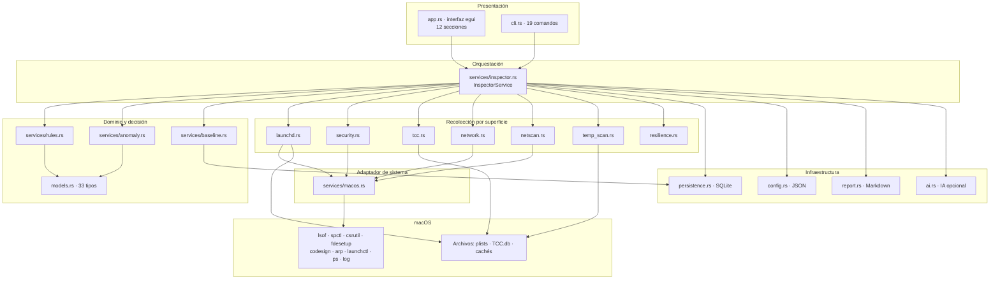
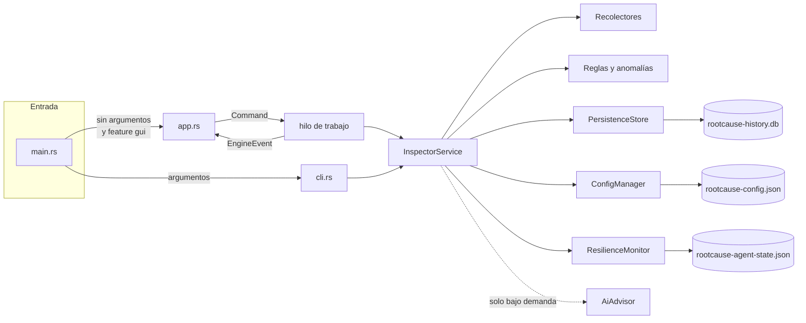
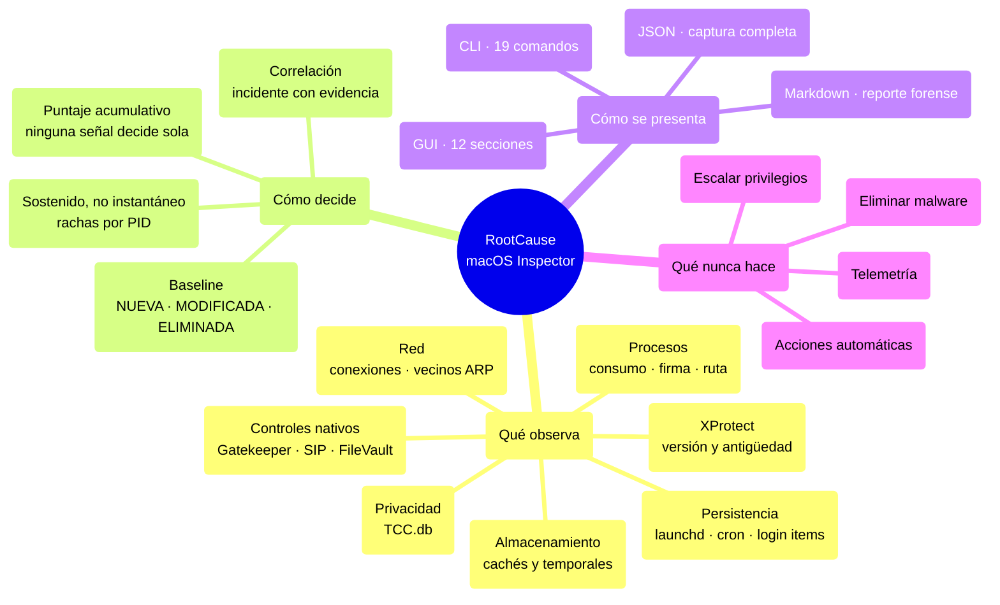
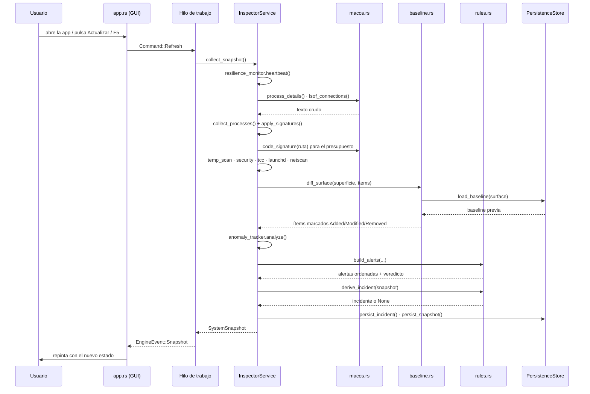
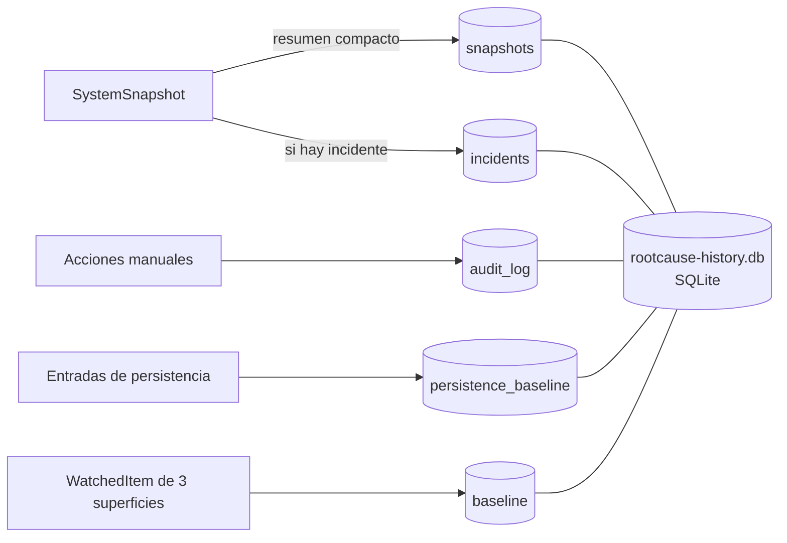
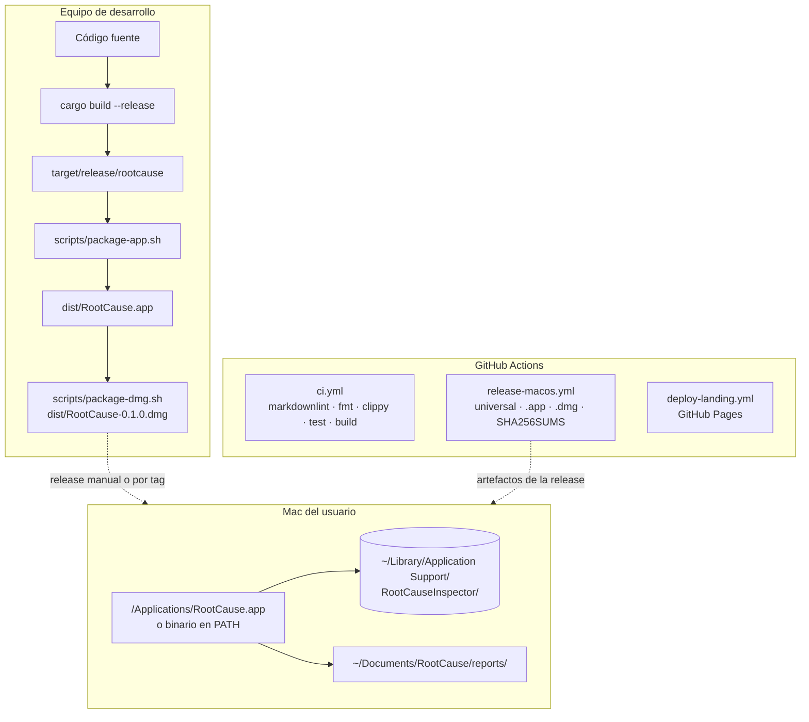
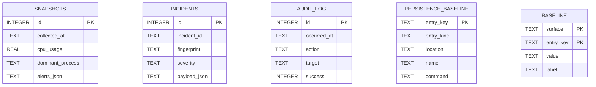
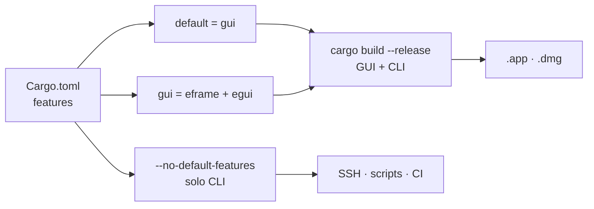

# 03 · Arquitectura

> Cómo está construido el sistema y por qué así. Cada diagrama va acompañado de su
> explicación en texto: el diagrama ayuda, pero la información está en la prosa.

---

## 1. Estilo arquitectónico

RootCause macOS Inspector es una **aplicación monolítica de escritorio con arquitectura en
capas y un adaptador de sistema operativo aislado**. No hay servidor, ni procesos auxiliares,
ni comunicación entre máquinas: un solo binario que puede presentarse como interfaz gráfica
o como comando.

Cinco decisiones definen el estilo:

1. **Una única fuente de verdad por captura.** Toda la información de un instante vive en un
   `SystemSnapshot`. La interfaz, el CLI, el exporte JSON, el reporte Markdown y el historial
   consumen ese mismo objeto; ninguno vuelve a consultar el sistema por su cuenta.
2. **Todo el contacto con macOS pasa por un módulo.** `services/macos.rs` es el único que
   ejecuta procesos externos. El resto del código recibe texto y lo parsea. Eso hace que
   los parsers sean funciones puras y, por tanto, comprobables sin un Mac detrás.
3. **Recolectar y decidir son trabajos distintos.** `services/inspector.rs` recoge;
   `services/rules.rs` y `services/anomaly.rs` deciden qué significa. Mezclarlos haría
   imposible probar el segundo.
4. **La interfaz nunca bloquea.** El motor vive en un hilo propio y se comunica por canales
   `std::sync::mpsc`. Una captura lenta no congela la ventana.
5. **Fallo suave por superficie.** Si `lsof` no está, si `TCC.db` no se puede leer o si
   `spctl` no responde, esa sección queda vacía y se explica; la captura sigue siendo útil.

## 2. Capas del sistema

### 2.1 Responsabilidad de cada capa

| Capa | Archivos | Responsabilidad | Qué **no** hace |
|---|---|---|---|
| **Presentación** | `app.rs`, `cli.rs` | Dibujar, formatear, recoger la intención del usuario | No ejecuta comandos del sistema ni decide severidades |
| **Orquestación** | `services/inspector.rs` | Secuenciar la captura, aplicar baselines, persistir, exponer acciones | No parsea salidas ni pinta |
| **Dominio y decisión** | `rules.rs`, `anomaly.rs`, `baseline.rs`, `models.rs` | Clasificar, puntuar, correlacionar, comparar contra baseline | No toca el sistema operativo ni el disco |
| **Recolección** | `launchd.rs`, `security.rs`, `tcc.rs`, `network.rs`, `netscan.rs`, `temp_scan.rs`, `resilience.rs` | Convertir una superficie del sistema en modelos de dominio | No decide el veredicto global |
| **Adaptador** | `services/macos.rs` | Ejecutar utilidades nativas y devolver texto | No interpreta el significado de ese texto |
| **Infraestructura** | `persistence.rs`, `config.rs`, `report.rs`, `ai.rs` | SQLite, JSON de configuración, Markdown, petición HTTPS opcional | No participa en la clasificación |

### 2.2 Regla de dependencias

Las dependencias apuntan hacia abajo y hacia el centro: la presentación depende de la
orquestación, la orquestación de todo lo demás, y el dominio no depende de nadie salvo de
los modelos. **`models.rs` no importa ningún otro módulo del proyecto**, lo que lo convierte
en el vocabulario común de todas las capas.

Excepciones reales, verificadas en el código:

- `services/security.rs` llama a `crate::services::launchd::loaded_labels()` para deducir si
  SSH está activo. Es una dependencia lateral entre recolectores, documentada en el propio
  código porque `systemsetup -getremotelogin` exige root.
- `services/anomaly.rs` usa `crate::services::network` para extraer IP y agrupar destinos.
  Reutiliza el parser en vez de duplicarlo.
- `services/inspector.rs` usa `crate::services::baseline`, que a su vez usa
  `PersistenceStore`: el motor de baseline necesita leer la foto anterior.

## 3. Diagrama de componentes

Lectura: `main.rs` es un despachador de tres líneas. Con argumentos (y salvo `--gui`) entrega
el control al CLI y sale con su código de retorno; sin argumentos abre la ventana. La
interfaz **no posee** el motor: lo posee un hilo de trabajo con el que habla por dos canales
tipados, `Command` hacia el motor y `EngineEvent` de vuelta. El CLI, en cambio, posee el
motor directamente porque su ejecución es de un solo disparo.

## 4. Mapa mental del sistema

## 5. Flujo principal: una captura

Puntos que el diagrama no muestra y conviene saber:

- El latido de resiliencia se ejecuta **antes** de nada, para que un cierre abrupto de la
  sesión anterior se refleje en esta captura.
- La verificación de firma no se aplica a todos los procesos: hay un presupuesto
  (`signature_budget`, 12 por defecto) y una caché por ruta, porque `codesign` cuesta un
  proceso por llamada.
- Tras resolver firmas, los procesos afectados **se reclasifican**: la firma es una señal
  fuerte y debe entrar en el puntaje.
- Si la persistencia en SQLite falla, no se pierde la captura: se añade una alerta de
  advertencia y la vista sigue funcionando.

## 6. Patrones de diseño identificados

| Patrón | Dónde | Por qué |
|---|---|---|
| **Adapter** | `services/macos.rs` | Aísla la dependencia del sistema operativo en un punto |
| **Facade** | `InspectorService` | Una sola superficie para GUI y CLI sobre siete recolectores |
| **Strategy** ligera | `SurfaceSpec` en `baseline.rs` | El mismo motor de diff sirve a cuatro superficies cambiando una constante |
| **Command / Event** | `Command` y `EngineEvent` en `app.rs` | Desacopla la interfaz del motor y evita bloqueos |
| **Repository** | `PersistenceStore` | Encapsula SQLite; el resto del código no ve SQL |
| **Value Object** | `WatchedItem`, `IncidentEvidence` | Unidades comparables y serializables sin identidad propia |
| **Null Object explícito** | `TccOverview::readable = false` | La ausencia de dato es un dato, no una lista vacía |
| **Guard clause** | Todos los parsers | `let … else { continue }` en vez de anidar |

## 7. Procesos síncronos y asíncronos

El proyecto **no usa `async`/`await` ni ningún runtime asíncrono**. La concurrencia se
resuelve con un hilo y canales:

| Ejecución | Modelo | Detalle |
|---|---|---|
| CLI | Síncrono, un disparo | `cli::run` crea el servicio, captura y sale con un código |
| GUI | Un hilo de interfaz + un hilo de motor | `spawn_worker` en `app.rs` |
| Barrido de red profundo | Síncrono dentro del hilo de motor | 254 `ping` en serie con `-t 1` |
| Log unificado | Síncrono bajo demanda | `log show` tarda segundos; nunca entra en la captura periódica |
| Petición IA | Síncrona, proceso hijo `curl` | Con `--max-time` configurable |

La GUI pide repintado con `ctx.request_repaint_after(120 ms)` mientras hay trabajo y
`900 ms` en reposo, y el motor llama a `ctx.request_repaint()` cada vez que responde.

## 8. Manejo de estado

| Estado | Dónde vive | Duración |
|---|---|---|
| Última captura | `RootCauseApp::snapshot` | Hasta la siguiente |
| Series de tendencia (CPU, memoria, escritura) | `Vec<f32>` con tope de 60 muestras | Sesión |
| Deltas de E/S por PID | `InspectorService::process_baselines` | Sesión; se purgan los PID muertos |
| Caché de firmas por ruta | `InspectorService::signature_cache` | Sesión |
| Rachas por PID y reapariciones | `AnomalyTracker` | Sesión |
| Baselines de superficie | Tablas `baseline` y `persistence_baseline` | Permanente hasta aceptar otra |
| Historial e incidentes | Tablas `snapshots` e `incidents` | Recortado a `history_limit` / `incident_limit` |
| Salud del agente | `rootcause-agent-state.json` | Entre ejecuciones |
| Idioma activo | `AtomicU8` global en `i18n.rs` | Proceso |
| Paleta activa | `static mut ACTIVE_DARK` en `app.rs` | Proceso, solo hilo de interfaz |

## 9. Manejo de errores

Tres niveles, deliberadamente distintos:

1. **Errores recuperables por superficie.** Un `Result` que se descarta con
   `unwrap_or_default()` y deja la sección vacía. Ejemplo: `macos::arp_table()` falla y
   `netscan::scan` devuelve cero dispositivos con sus limitaciones declaradas.
2. **Errores que el usuario debe ver.** Se propagan con `anyhow::Result` y contexto
   (`.context("No se pudo guardar el reporte")`), y acaban en la barra de estado de la GUI
   o en `stderr` del CLI con código de salida `1`.
3. **Errores que no deben ocurrir.** No hay `unwrap()` sobre entradas externas en la ruta de
   captura; los `expect` viven en los tests.

Además, los errores de una acción manual **se auditan igual que los éxitos**:
`InspectorService::audit` recibe `Option<&anyhow::Error>` y guarda el detalle.

## 10. Autenticación y autorización

No existen dentro del producto: **no hay cuentas, sesiones, roles ni tokens propios**. La
autorización es la del sistema operativo, y el código la trata como un hecho observable:

- `macos::environment()` declara usuario, UID, si es root y qué utilidades faltan.
- `tcc::scan()` declara si pudo leer las bases y si hay Acceso total al disco.
- `InspectorService::can_terminate_process` aplica una **política local** por encima de la
  del sistema: nunca el propio proceso, nunca PID ≤ 1, nunca uno de los trece nombres
  protegidos (`kernel_task`, `launchd`, `windowserver`, `loginwindow`, `opendirectoryd`,
  `securityd`, `syspolicyd`, `configd`, `powerd`, `hidd`, `coreaudiod`, `notifyd`,
  `diskarbitrationd`).

## 11. Persistencia y caché

Cinco tablas en un único archivo SQLite. No hay ORM: `rusqlite` con SQL literal en
`persistence.rs`. Las tablas de volumen (`snapshots`, `incidents`) se recortan tras cada
inserción con `trim_table`, así que el archivo no crece sin límite. Esquema completo en
[07 · Base de datos](07-database.md).

Cachés en memoria: firmas por ruta, deltas de E/S por PID e historial de rachas. Ninguna
sobrevive al proceso, por decisión: una caché de firmas persistida podría dar por buena la
firma de un binario que fue sustituido.

## 12. Procesos en segundo plano

| Proceso | Disparo | Coste |
|---|---|---|
| Hilo de motor (GUI) | Al arrancar la app | Vive hasta `Command::Shutdown` |
| Refresco automático | Temporizador de `refresh_interval_secs` (mínimo forzado 2 s) | Una captura |
| Latido de resiliencia | Dentro de cada captura, con intervalo propio (15 s) | Escritura de un JSON pequeño |
| Notificación crítica | Alerta crítica + `notify_on_critical` | Un `osascript` |
| Barrido profundo de red | Solo botón «Escaneo profundo» o `network --deep` | 254 `ping` en serie |
| Log unificado | Solo sección Historial o `events` | Segundos de `log show` |

**No hay demonio ni LaunchAgent propio**: RootCause no se instala como servicio y no se
ejecuta si nadie lo abre. Es una decisión de producto coherente con su posicionamiento —una
herramienta que vigila la persistencia ajena no debería añadir la suya sin decirlo.

## 13. Diagrama de despliegue

El despliegue es una descarga o una compilación local: no hay servidor, ni actualizador
automático, ni canal de distribución propio. Los binarios publicados **no están firmados ni
notarizados**, lo que el propio cuerpo de la release advierte.

## 14. Diagrama entidad-relación

El modelo de datos persistido es deliberadamente plano. Detalle y diccionario de datos en
[07 · Base de datos](07-database.md).

No hay claves foráneas declaradas: las tablas son independientes por diseño. La relación
entre un incidente y la captura que lo originó existe **por marca de tiempo**
(`collected_at`), no por referencia. Es una simplificación consciente que se documenta como
deuda técnica menor en [15 · Riesgos](15-risks-and-technical-debt.md).

## 15. Ediciones de compilación

La edición CLI-only no compila `app.rs`. Para que eso no genere avisos de código muerto en
funciones compartidas, `main.rs` declara
`#![cfg_attr(not(feature = "gui"), allow(dead_code))]`, con un comentario que explica que no
es código muerto sino código usado por la otra edición. **La CI compila las dos** en cada
push, así que ninguna se rompe en silencio.

## 16. Decisiones arquitectónicas y sus consecuencias

| Decisión | Ventaja | Coste aceptado |
|---|---|---|
| Ejecutar utilidades del sistema en vez de usar APIs nativas | Cero dependencias de FFI; salida auditable que se puede mostrar como evidencia | Coste de proceso por llamada; formatos que cambian entre versiones de macOS |
| Traducción local con `tr(es, en)` en vez de diccionario con claves | Imposible una clave huérfana; cero asignaciones | Las cadenas se repiten en el código |
| Estado global para idioma y paleta | No hay que cablear parámetros por cada función de dibujo | `static mut` requiere `unsafe` y solo es válido en el hilo de interfaz |
| SQLite embebido (`bundled`) | No depende de la librería del sistema | Primera compilación más lenta |
| Sin cliente HTTP; `curl` para la IA | Ninguna dependencia nueva por una función opcional | Depende de que `curl` exista (viene con macOS) |
| Baseline «pegajosa» | Un cambio no se auto-silencia tras un reinicio | Requiere que el usuario acepte explícitamente |
| Primera baseline sembrada en silencio | Estrenar la herramienta no genera cien alertas | La primera ejecución no detecta lo que ya estaba mal |

Esa última fila es la más importante del documento: **RootCause detecta cambios, no estados
malos preexistentes**. Si el equipo ya estaba comprometido cuando se sembró la baseline, esa
persistencia quedará marcada como conocida. El producto lo dice en su documentación y es la
limitación estructural del enfoque.

---

**Siguiente lectura recomendada:** [04 · Mapa completo del código](04-code-map.md) para
bajar al detalle de archivos y funciones.
