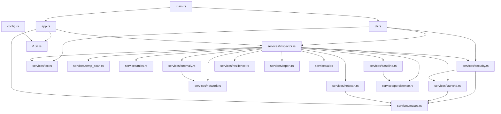

# 04 · Mapa completo del código

> Inventario jerárquico del repositorio: qué hay en cada carpeta, qué hace cada archivo,
> de qué depende, quién lo usa y qué estado tiene. Las cifras de líneas corresponden al
> commit analizado e incluyen los módulos de test.

---

## 1. Vista general del repositorio

```text
rootcause-macos-inspector/
├── .claude/agents/          ← definición del agente documentador (este análisis)
├── .github/workflows/       ← 3 workflows de GitHub Actions
├── assets/                  ← icono de marca en SVG
├── docs/                    ← 39 documentos + este conjunto de sistema
├── landing/                 ← página del producto para GitHub Pages
├── packaging/
│   ├── homebrew/            ← plantilla de cask
│   └── macos/               ← Info.plist y entitlements del .app
├── scripts/                 ← 5 scripts shell + 2 Python
├── src/                     ← 23 archivos Rust · 12 956 líneas
├── Cargo.toml · Cargo.lock  ← manifiesto y versiones fijadas
├── rust-toolchain.toml      ← canal estable + rustfmt y clippy
├── rustfmt.toml             ← ancho 100, saltos Unix
├── .markdownlint-cli2.jsonc ← convenciones de Markdown
├── README.md · LICENSE · SECURITY.md
└── .gitignore
```

## 2. Directorios

| Directorio | Archivos | Responsabilidad | Estado |
|---|---:|---|---|
| `src/` | 23 | Todo el código del producto | Activo |
| `src/services/` | 16 | Lógica no visual: recolección, decisión, persistencia | Activo |
| `docs/` | 39 | Documentación de producto, arquitectura y operación | Activo |
| `docs/requirements/` | 4 | Registro permanente de requisitos de seguridad | Activo |
| `docs/system-documentation/` | 20 + PDF | Este conjunto documental | Activo |
| `scripts/` | 7 | Verificación, empaquetado, release, CI local, iconos, PDF | Activo |
| `packaging/macos/` | 2 | `Info.plist` y `entitlements.plist` del `.app` | Activo |
| `packaging/homebrew/` | 1 | Cask de Homebrew | **Plantilla**: sin tap publicado |
| `landing/` | 4 | Página estática publicada en GitHub Pages | Activo |
| `assets/` | 1 | `rootcause-icon.svg`, fuente del icono | Activo |
| `.github/workflows/` | 3 | CI, release y despliegue de la landing | Activo |
| `dist/`, `target/` | — | Artefactos de compilación | Ignorados por Git |

## 3. Archivos raíz de `src/`

### 3.1 `src/main.rs` — 119 líneas

| Aspecto | Detalle |
|---|---|
| **Responsabilidad** | Punto de entrada: decide modo CLI o GUI, construye la ventana y dibuja el icono |
| **Elementos** | `main()`, `launch_gui()` *(feature `gui`)*, `rootcause_icon()` *(feature `gui`)* |
| **Dependencias** | `app`, `cli`, `meta`, `eframe` |
| **Quién lo usa** | El sistema operativo |
| **Flujo** | Con argumentos (salvo `--gui`) → `cli::run` y `exit`; sin argumentos → ventana |
| **Importancia** | Alta: es el único punto de arranque |
| **Nota** | Declara `#![cfg_attr(not(feature = "gui"), allow(dead_code))]` para la edición CLI-only |

### 3.2 `src/meta.rs` — 40 líneas

Constantes de identidad del producto: `VERSION` (leída de `CARGO_PKG_VERSION`),
`DISPLAY_NAME`, `DESCRIPTION`, `AUTHOR`, `GITHUB`, `GITHUB_WINDOWS`, `LICENSE`, `BUNDLE_ID`
y `APP_DIR`. Sin lógica. Lo usan `cli.rs`, `app.rs`, `inspector.rs` y `report.rs`.

`APP_DIR` (`"RootCauseInspector"`) es el que determina la carpeta de datos del usuario, así
que cambiarlo deja huérfanos el historial y las baselines existentes.

### 3.3 `src/i18n.rs` — 107 líneas

| Aspecto | Detalle |
|---|---|
| **Responsabilidad** | Traducción ES/EN local al punto de uso |
| **Elementos** | `enum Lang`, `Lang::code`, `Lang::native_name`, `set_lang`, `current_lang`, `tr` |
| **Estado** | `static CURRENT: AtomicU8` |
| **Quién lo usa** | Solo `app.rs`: el CLI está únicamente en español |
| **Diseño** | `tr("Resumen", "Overview")` en vez de diccionario con claves: imposible una clave huérfana, cero asignaciones |
| **Tests** | 2 |

### 3.4 `src/models.rs` — 754 líneas

El vocabulario común. **No importa ningún otro módulo del proyecto**, solo `chrono` y
`serde`. 33 tipos públicos:

| Grupo | Tipos |
|---|---|
| Severidad y estado | `Severity`, `RiskLevel`, `AgentStatus`, `CodeSignature`, `PersistenceChange`, `PersistenceScope` |
| Resumen de captura | `SystemOverview`, `SystemSnapshot`, `SnapshotRow`, `HardwareInfo` |
| Hallazgos | `Alert`, `AnomalyEvent`, `IncidentSummary`, `IncidentEvidence`, `AiIncidentAdvice` |
| Superficies | `ProcessInsight`, `PersistenceEntry`, `SecurityControl`, `MalwareDefinition`, `XProtectStatus`, `TccPermission`, `TccOverview`, `ConnectionInsight`, `NetworkDevice`, `NetworkScan`, `CacheEntry`, `CacheOverview`, `CacheCleanResult`, `EventRecord`, `ServiceState` |
| Baseline y auditoría | `WatchedItem`, `AuditRecord`, `AgentHealth` |

Todos derivan `Serialize`/`Deserialize` salvo `HardwareInfo` (solo `Debug`, `Clone`,
`Default`) y `SnapshotRow` (solo `Serialize`). Los campos añadidos después llevan
`#[serde(default)]`, de modo que **un JSON exportado por una versión anterior sigue
deserializando**. Tests: 5.

### 3.5 `src/config.rs` — 676 líneas

| Aspecto | Detalle |
|---|---|
| **Responsabilidad** | Configuración operativa en JSON, con valores por defecto explícitos |
| **Tipos** | `RootCauseConfig` y ocho secciones: `CollectionConfig`, `ThresholdsConfig` (con `ProcessThresholds`, `CacheThresholds`, `XProtectThresholds`), `AnomalyConfig`, `AlertingConfig`, `RemediationConfig`, `ResilienceConfig`, `AiConfig`, `UiConfig`; más `ThemeMode` y `ConfigManager` |
| **Funciones** | `ConfigManager::load_or_default`, `write_default_if_missing`, `path`, `config`, `save_to_path`, `config_path`, `example_config_json` |
| **Dependencias** | `i18n::Lang`, `serde`, `dirs` |
| **Quién lo usa** | `inspector.rs`, `app.rs`, `cli.rs`, `rules.rs`, `anomaly.rs`, `security.rs`, `temp_scan.rs`, `resilience.rs`, `ai.rs` |
| **Patrón** | Cada campo tiene una función `default_*()` referenciada por `#[serde(default = "…")]`, lo que hace que un JSON parcial sea válido |
| **Tests** | 3 |

### 3.6 `src/cli.rs` — 960 líneas

| Aspecto | Detalle |
|---|---|
| **Responsabilidad** | 19 comandos, casi todos con `--json` |
| **Entrada** | `pub fn run(args: &[String]) -> i32` |
| **Utilidades internas** | `wants`, `flag_value`, `first_number`, `service`, `print_json`, `severity_mark`, `risk_mark`, `truncate` |
| **Comandos** | `status`, `snapshot`, `history`, `incidents`, `audit`, `export`, `report`, `persistence`, `security`, `xprotect`, `tcc`, `connections`, `network`, `events`, `clean-caches`, `kill`, `block-ip`, `config`, `ai` |
| **Códigos de salida** | `0` correcto · `1` error de ejecución · `2` uso incorrecto |
| **Dependencias** | `InspectorService`, `security`, `tcc`, `meta`, `models` |
| **Nota** | No usa `clap` ni ninguna librería de parseo: banderas a mano, sin dependencias nuevas |
| **Tests** | 8 |

### 3.7 `src/app.rs` — 2 750 líneas

El archivo más grande del proyecto. Contiene la interfaz completa.

| Bloque | Elementos |
|---|---|
| Paleta | `struct Palette`, `DARK`, `LIGHT`, `pal()`, `set_dark()`, `system_prefers_dark()` |
| Hilo de trabajo | `enum Command` (20 variantes), `enum EngineEvent` (10 variantes), `spawn_worker()` |
| Navegación | `enum Tab` (12 secciones) con `title`, `subtitle`, `group` y `ALL` |
| Estado | `pub struct RootCauseApp` con 26 campos |
| Ciclo de vida | `RootCauseApp::new`, `send`, `drain_responses`, `maybe_auto_refresh`, `apply_theme`, `update`, `on_exit` |
| Secciones | `draw_overview`, `draw_processes`, `draw_connections`, `draw_network`, `draw_persistence`, `draw_security`, `draw_privacy`, `draw_storage`, `draw_history`, `draw_config`, `draw_manual`, `draw_about` |
| Cromo | `draw_sidebar`, `tab_badge`, `sidebar_item`, `draw_topbar`, `draw_statusbar` |
| Widgets | `card`, `section`, `note`, `empty`, `loading`, `limitations`, `action_button`, `pill`, `signature_pill`, `summary_pill`, `metric_card`, `sparkline`, `severity_dot`, `draw_logo`, `table_header`, `fact`, `info_row`, `slider_row`, `threshold_row` |
| Auxiliares | `configure_style`, `severity_color`, `verdict_title`, `push_sample`, `percent`, `truncate` |

**Estado aparente:** activo, pero es el candidato natural a división. Se documenta como
deuda técnica en [15 · Riesgos](15-risks-and-technical-debt.md). Tests: 5.

## 4. Módulos de servicio (`src/services/`)

### 4.1 `mod.rs` — 34 líneas

Declara los quince módulos de servicio. Sin lógica.

### 4.2 `inspector.rs` — 1 148 líneas · orquestador

| Aspecto | Detalle |
|---|---|
| **Tipo principal** | `pub struct InspectorService` |
| **Campos** | `system`, `networks`, `process_baselines`, `protected_names`, `own_pid`, `store`, `config`, `config_path`, `config_warning`, `resilience_monitor`, `anomaly_tracker`, `signature_cache` |
| **Función central** | `collect_snapshot()` |
| **Privadas clave** | `collect_processes`, `apply_signatures`, `reclassify_with_signatures`, `collect_services`, `diff_persistence_baseline`, `detect_persistence_changes`, `detect_security_changes`, `detect_tcc_changes`, `annotate_network_changes`, `detect_network_changes`, `can_terminate_process`, `audit` |
| **Acciones públicas** | `accept_*_baseline` (4), `scan_network`, `login_items`, `security_events`, `clean_caches`, `terminate_process`, `reveal_in_finder`, `suggest_block_ip`, `generate_report`, `export_snapshot`, `export_history_backup`, `explain_latest_incident_with_ai` |
| **Depende de** | Los quince módulos de servicio, `config`, `models`, `meta`, `sysinfo` |
| **Lo usan** | `cli.rs` y el hilo de trabajo de `app.rs` |
| **Ciclo de vida** | `impl Drop` registra el cierre limpio en la auditoría |
| **Tests** | 3 |

### 4.3 `macos.rs` — 537 líneas · adaptador de sistema

Único módulo que ejecuta procesos. 27 elementos públicos, agrupados:

| Grupo | Funciones |
|---|---|
| Ejecución | `run_capture`, `run_combined`, `command_exists` |
| Identidad del sistema | `sysctl`, `product_version`, `product_name`, `build_version` |
| Identidad del usuario | `current_user`, `current_uid`, `is_root` |
| Contexto | `struct EnvironmentReport`, `EnvironmentReport::missing_tools`, `environment` |
| Procesos | `struct ProcessDetail`, `process_details`, `terminate_process` |
| Interacción | `reveal_in_finder`, `notify` |
| Firma | `code_signature`, `classify_codesign_output` |
| Red | `lsof_connections`, `arp_table`, `default_route`, `interface_addresses`, `discovery_sweep`, `reverse_dns` |
| Registro | `security_log_events` |

Reglas declaradas en el propio módulo: solo lectura por defecto, nada de `sudo` implícito y
fallo suave. Las dos únicas funciones que modifican estado son `terminate_process` y
`reveal_in_finder`, y ambas se auditan en la capa superior. Tests: 7.

### 4.4 `launchd.rs` — 498 líneas · persistencia

| Aspecto | Detalle |
|---|---|
| **Públicas** | `scan_persistence`, `login_items`, `classify_entry`, `launchctl_jobs`, `loaded_labels` |
| **Privadas** | `struct LaunchDir`, `LAUNCH_DIRS` (5 carpetas), `expand_home`, `parse_launch_plist`, `scan_cron` |
| **Entrada** | Archivos `.plist`, `crontab -l`, `osascript`, `launchctl list` |
| **Salida** | `Vec<PersistenceEntry>` clasificada por riesgo |
| **Lo usa** | `inspector.rs` y, para SSH, `security.rs` |
| **Riesgo** | `classify_entry` acumula siete señales; el umbral de crítico es 85 puntos |
| **Tests** | 5 |

### 4.5 `security.rs` — 498 líneas · controles nativos y XProtect

| Aspecto | Detalle |
|---|---|
| **Públicas** | `scan_controls`, `control_watch_items`, `scan_xprotect` |
| **Privadas** | `gatekeeper`, `system_integrity_protection`, `filevault`, `application_firewall`, `firewall_stealth_mode`, `remote_login`, `status_text`, `severity_for`, `first_line`, `read_definition`, `age_severity`, `age_note`, `DEFINITION_PATHS` |
| **Criterio** | El estado seguro es el de fábrica; «desconocido» nunca se pinta de verde |
| **Excepción** | El modo encubierto informa pero nunca sube de verde: viene apagado de fábrica |
| **Tests** | 5 |

### 4.6 `tcc.rs` — 382 líneas · privacidad

| Aspecto | Detalle |
|---|---|
| **Públicas** | `service_label`, `scan`, `decode_decision`, `is_sensitive`, `permission_watch_items` |
| **Privadas** | `SENSITIVE_SERVICES` (9), `user_db_path`, `system_db_path`, `read_database`, `table_columns`, `severity_for`, `note_for`, `format_epoch` |
| **Entrada** | Dos SQLite del sistema abiertos con `SQLITE_OPEN_READ_ONLY` |
| **Compatibilidad** | Detecta el esquema con `PRAGMA table_info` (`auth_value` moderno vs `allowed` heredado) |
| **Ironía documentada** | Leer `TCC.db` exige Acceso total al disco; sin él devuelve `readable = false` |
| **Tests** | 6 |

### 4.7 `network.rs` — 359 líneas · conexiones por proceso

| Aspecto | Detalle |
|---|---|
| **Públicas** | `parse_lsof_field_output`, `classify_connection`, `extract_ip`, `is_public_ip`, `unique_public_remotes_by_pid` |
| **Privadas** | `struct FieldState`, `push_connection`, `split_endpoints`, `is_public_v4`, `is_public_v6` |
| **Entrada** | Salida de `lsof -i -n -P -FpcLftPnT` (modo campo) |
| **Por qué modo campo** | El formato tabular se rompe con nombres como `Google Chrome` |
| **Función pura** | Todo el módulo lo es: se prueba con una muestra literal de `lsof` |
| **Tests** | 6 |

### 4.8 `netscan.rs` — 479 líneas · vecinos de red

| Aspecto | Detalle |
|---|---|
| **Públicas** | `scan`, `parse_arp_table`, `normalize_mac`, `vendor_from_mac`, `subnet_prefix_of`, `device_key`, `classify_device`, `device_watch_items`, `device_from_watch_item`, `new_device_event` |
| **Privadas** | `OUI_TABLE` (26 prefijos), `ip_sort_key` |
| **Caso crítico** | Cambio de MAC de la puerta de enlace → `RiskLevel::Critical`, puntaje 92 |
| **Detalle fino** | `normalize_mac` rellena octetos sin cero a la izquierda, porque macOS imprime `0:11:22` y eso rompería la comparación con la baseline |
| **Tests** | 8 |

### 4.9 `temp_scan.rs` — 298 líneas · almacenamiento

| Aspecto | Detalle |
|---|---|
| **Públicas** | `scan`, `clean_user_caches` |
| **Privadas** | `struct CacheRoot`, `CACHE_ROOTS` (7 raíces), `expand_home`, `measure_directory`, `severity_for_size`, `bytes_to_mb` |
| **Tope** | `MAX_ENTRIES_PER_ROOT = 40 000` entradas por raíz |
| **Salvaguardas de limpieza** | Solo `~/Library/Caches`, solo lo no tocado en 24 h, salta lo que esté en uso, `dry_run` por defecto |
| **Tests** | 5 |

### 4.10 `rules.rs` — 743 líneas · clasificación e incidentes

| Aspecto | Detalle |
|---|---|
| **Públicas** | `struct AlertBuildInputs`, `classify_process`, `build_alerts`, `derive_incident` |
| **Privadas** | `categorize`, `incident_evidence`, `probable_causes`, `recommended_actions`, `dedupe_strings` |
| **Naturaleza** | Funciones puras sobre estructuras de datos: por eso está cubierto por 11 tests |
| **Orden de alertas** | Anomalías → controles → XProtect → persistencia → procesos → puertos → TCC → cachés |
| **Tests** | 11 |

### 4.11 `anomaly.rs` — 849 líneas · heurísticas

| Aspecto | Detalle |
|---|---|
| **Públicas** | `struct DetectionInput`, `struct AnomalyTracker`, `AnomalyTracker::analyze`, `persistence_change_event` |
| **Privadas** | `struct ProcessHistory`, `struct RespawnTrace`, `track_respawns`, `is_trusted`, `lower_path_of`, `is_trusted_path`, `unique_private_remotes_by_pid`, `process_event` |
| **Ocho heurísticas** | `sustained-cpu`, `memory-growth`, `aggressive-write`, `unusual-outbound`, `local-scan`, `suspicious-path`, `unsigned-binary`, `fast-respawn` |
| **Estado** | `HashMap<u32, ProcessHistory>` y `HashMap<String, RespawnTrace>` |
| **Tests** | 14, el módulo mejor cubierto del proyecto |

### 4.12 `baseline.rs` — 217 líneas · motor de cambios

| Aspecto | Detalle |
|---|---|
| **Públicas** | `struct SurfaceSpec`, `SECURITY_SURFACE`, `TCC_SURFACE`, `NETWORK_SURFACE_ID`, `diff_surface`, `surface_change_event` |
| **Idea** | Comparar `WatchedItem` actuales contra la foto guardada y marcar `Added`/`Modified`/`Removed` |
| **Dos decisiones** | La primera foto se siembra en silencio; los cambios son pegajosos hasta que se aceptan |
| **Tests** | 4 |

### 4.13 `persistence.rs` — 564 líneas · SQLite

| Aspecto | Detalle |
|---|---|
| **Públicas** | `persistence_entry_key`, `struct PersistenceStore` y 18 métodos |
| **Privadas** | `load_incident_by_id`, `trim_table`, `ensure_schema` |
| **Tablas** | `snapshots`, `incidents`, `audit_log`, `persistence_baseline`, `baseline` |
| **Estilo** | SQL literal con `rusqlite`; sin ORM ni migraciones |
| **Detalle** | Cada método abre su propia `Connection`: sencillo y suficiente para el volumen real |
| **Tests** | 2 |

### 4.14 `resilience.rs` — 295 líneas · salud del agente

| Aspecto | Detalle |
|---|---|
| **Públicas** | `struct ResilienceMonitor`, `new`, `health`, `startup_audits`, `heartbeat`, `shutdown` |
| **Privadas** | `struct AgentStateFile`, `persist`, `config_fingerprint` |
| **Qué detecta** | Cierre abrupto anterior, cambio de configuración entre sesiones, reinicios repetidos en ventana |
| **Honestidad** | La huella de configuración es tamaño + fecha, **no un hash criptográfico**, y el código lo dice |
| **Tests** | 3 |

### 4.15 `report.rs` — 342 líneas · reporte forense

| Aspecto | Detalle |
|---|---|
| **Públicas** | `reports_dir`, `build_report`, `save_report` |
| **Privadas** | `severity_word`, `nonempty`, `escape` |
| **Salida** | Markdown de 11 secciones en `~/Documents/RootCause/reports/rootcause-report-<fecha>.md` |
| **Detalle** | `escape` neutraliza `\|` y saltos de línea para no romper las tablas |
| **Tests** | 4 |

### 4.16 `ai.rs` — 277 líneas · adaptador IA opcional

| Aspecto | Detalle |
|---|---|
| **Públicas** | `struct AiAdvisor`, `new`, `summarize_incident`, `parse_response` |
| **Privadas** | `struct AiOutputShape`, `build_payload`, `post_json`, `provider_from_endpoint` |
| **Transporte** | `curl` como proceso hijo, cuerpo por `stdin` (`--data @-`) para que no aparezca en la lista de procesos |
| **Tres garantías** | Apagado por defecto · la clave vive en una variable de entorno · solo viaja el incidente ya resumido |
| **Tests** | 6, incluido uno que comprueba que el payload no contiene datos de TCC |

## 5. Resumen cuantitativo de `src/`

| Archivo | Líneas | Elementos públicos | Tests | Estado |
|---|---:|---:|---:|---|
| `app.rs` | 2 750 | 2 | 5 | Activo · candidato a dividir |
| `services/inspector.rs` | 1 148 | 32 | 3 | Activo |
| `cli.rs` | 960 | 1 | 8 | Activo |
| `services/anomaly.rs` | 849 | 4 | 14 | Activo |
| `models.rs` | 754 | 43 | 5 | Activo |
| `services/rules.rs` | 743 | 4 | 11 | Activo |
| `config.rs` | 676 | 21 | 3 | Activo |
| `services/persistence.rs` | 564 | 20 | 2 | Activo |
| `services/macos.rs` | 537 | 27 | 7 | Activo |
| `services/launchd.rs` | 498 | 5 | 5 | Activo |
| `services/security.rs` | 498 | 3 | 5 | Activo |
| `services/netscan.rs` | 479 | 10 | 8 | Activo |
| `services/tcc.rs` | 382 | 5 | 6 | Activo |
| `services/network.rs` | 359 | 5 | 6 | Activo |
| `services/report.rs` | 342 | 3 | 4 | Activo |
| `services/temp_scan.rs` | 298 | 2 | 5 | Activo |
| `services/resilience.rs` | 295 | 6 | 3 | Activo |
| `services/ai.rs` | 277 | 4 | 6 | Activo · opcional |
| `services/baseline.rs` | 217 | 6 | 4 | Activo |
| `main.rs` | 119 | 0 | 0 | Activo |
| `i18n.rs` | 107 | 6 | 2 | Activo |
| `meta.rs` | 40 | 9 | 0 | Activo |
| `services/mod.rs` | 34 | 15 | 0 | Activo |
| **Total** | **12 956** | **232** | **112** | — |

## 6. Grafo de dependencias entre módulos



No hay ciclos. `models.rs` y `meta.rs` no aparecen porque los importa casi todo y solo
añadirían ruido: ninguno depende de nadie.

## 7. Archivos fuera de `src/`

### 7.1 Scripts

| Script | Líneas | Qué hace | Estado |
|---|---:|---|---|
| `scripts/verify-environment.sh` | 100 | Comprueba sistema, toolchain, utilidades, permisos | Activo |
| `scripts/ci-local.sh` | 33 | Réplica exacta del job de validación de la CI | Activo |
| `scripts/package-app.sh` | 96 | Construye `dist/RootCause.app`, con `--universal` | Activo |
| `scripts/package-dmg.sh` | 81 | Construye el `.dmg` y `SHA256SUMS.txt` | Activo |
| `scripts/release-product.sh` | 266 | Orquesta validación, build, empaquetado, tag y publicación | Activo |
| `scripts/make-icon.py` | 116 | Genera `AppIcon.icns` desde el SVG de marca | Activo |
| `scripts/build-docs-pdf.py` | 391 | Genera los PDF de esta documentación | Activo · añadido en este análisis |

### 7.2 Workflows

| Workflow | Disparo | Jobs |
|---|---|---|
| `.github/workflows/ci.yml` | push y PR a `main`, manual | `docs` (markdownlint, Ubuntu) y `validate` (fmt, clippy, test, dos builds, humo, artefacto; macOS) |
| `.github/workflows/release-macos.yml` | tags `v*`, manual | Build universal, `.app`, `.dmg`, hashes, artefacto y release de GitHub |
| `.github/workflows/deploy-landing.yml` | push a `main` que toque `landing/` | Publica en GitHub Pages |

### 7.3 Empaquetado

| Archivo | Contenido |
|---|---|
| `packaging/macos/Info.plist` | Identidad del bundle, `LSMinimumSystemVersion = 13.0`, `NSAppleEventsUsageDescription` |
| `packaging/macos/entitlements.plist` | Entitlements del `.app` |
| `packaging/homebrew/rootcause.rb` | Cask de Homebrew · **plantilla**, sin tap publicado |

### 7.4 Configuración del repositorio

| Archivo | Contenido relevante |
|---|---|
| `Cargo.toml` | Versión, features `default = ["gui"]`, 10 dependencias directas, perfil de release |
| `Cargo.lock` | 326 paquetes con versión exacta |
| `rust-toolchain.toml` | `channel = "stable"`, componentes `rustfmt` y `clippy` |
| `rustfmt.toml` | `edition = 2021`, `max_width = 100`, `newline_style = "Unix"` |
| `.markdownlint-cli2.jsonc` | `MD013` a 100 caracteres con tablas y código exentos; `MD060` y `MD041` desactivadas |
| `.gitignore` | `target/`, `dist/`, `*.dmg`, `*.app`, `.DS_Store`, `._*` |

## 8. Elementos obsoletos, duplicados o sin uso

Búsqueda explícita de código muerto, duplicación y restos:

| Hallazgo | Evidencia | Valoración |
|---|---|---|
| `config.anomaly.suspicious_parent_names` y `shell_interpreters` | Se declaran y se serializan, pero **ninguna heurística los lee** en el commit analizado | Configuración sin efecto: se documenta como deuda en [15](15-risks-and-technical-debt.md) |
| `config.ui.daily_report` | Campo presente, sin código que genere el reporte diario | Funcionalidad declarada y no implementada |
| `config.alerting.notification_cooldown_secs` | Declarado; ninguna lectura fuera de `config.rs` | El anti-repetición de notificaciones no está implementado |
| `config.resilience.stale_after_secs` | Declarado; ninguna lectura fuera de `config.rs` | La detección de latido caducado no está implementada |
| `models::Severity::label` y `RiskLevel::label` | Definidos y usados solo parcialmente por la GUI | Activos; sin riesgo |
| `meta::GITHUB_WINDOWS`, `meta::DESCRIPTION`, `meta::BUNDLE_ID`, `meta::LICENSE` | Usados solo por la sección Acerca de la GUI | En la edición CLI-only quedan sin usar; lo cubre el `allow(dead_code)` declarado en `main.rs` |
| `expand_home` | Implementada dos veces, en `launchd.rs` y en `temp_scan.rs` | Duplicación menor de 6 líneas, sin divergencia de comportamiento |
| `bytes_to_mb` | Implementada en `inspector.rs` y en `temp_scan.rs` | Igual que la anterior |
| `services/macos.rs::reverse_dns` | Solo se llama en el escaneo profundo | Activo, uso condicionado |
| `launchd::loaded_labels` | Solo la usa `security.rs::remote_login` | Activo |

No se encontró ningún módulo, archivo ni función completamente sin uso.

---

**Siguiente lectura recomendada:** [05 · Referencia técnica](05-technical-reference.md) para
el catálogo función a función, o [06 · Explicación profunda](06-deep-code-explanation.md)
para entender el flujo interno.
