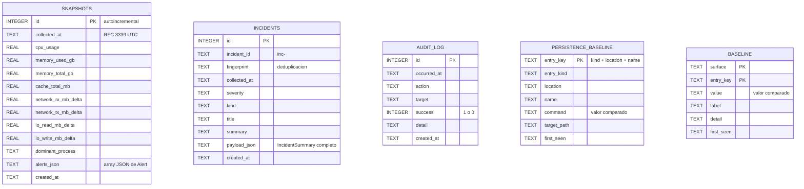

# 07 · Base de datos

> Todo lo que RootCause persiste: dónde, con qué esquema, con qué consultas y con qué
> política de retención. Incluye también las dos bases **ajenas** que el producto lee sin
> escribir nunca: las `TCC.db` de macOS.

---

## 1. Resumen

| Aspecto | Valor |
|---|---|
| Motor | SQLite 3, embebido en el binario (`rusqlite` con `bundled`) |
| Archivo | `~/Library/Application Support/RootCauseInspector/rootcause-history.db` |
| Tablas | 5 |
| Índices explícitos | 1 |
| Claves foráneas | Ninguna |
| Migraciones | No hay: `CREATE TABLE IF NOT EXISTS` en cada arranque |
| ORM | No; SQL literal en `src/services/persistence.rs` |
| Acceso concurrente | Una conexión por operación; sin pool |
| Cifrado en reposo | No propio; depende de FileVault |
| Salida a red | Ninguna: la base nunca se envía a ningún sitio |

## 2. Conexión

`PersistenceStore::new(app_name)`:

1. Resuelve `dirs::data_local_dir()` con respaldo `dirs::data_dir()`. En macOS, ambas
   apuntan a `~/Library/Application Support`.
2. Le añade `app_name` (`meta::APP_DIR` = `"RootCauseInspector"`) y crea el directorio con
   `create_dir_all`.
3. Compone `rootcause-history.db` y llama a `ensure_schema()`.

No hay cadena de conexión, ni usuario, ni contraseña, ni configuración de red: **es un
archivo local del usuario**. Si el directorio no se puede crear, `InspectorService::new`
falla y quien llama lo explica.

## 3. Esquema

### 3.1 `snapshots` — historial de capturas

Resumen compacto de cada captura, para tendencias y para la sección Historial.

| Columna | Tipo | Nulo | Por defecto | Descripción |
|---|---|---|---|---|
| `id` | INTEGER | No | autoincremental | Clave primaria |
| `collected_at` | TEXT | No | — | Instante de la captura, RFC 3339 en UTC |
| `cpu_usage` | REAL | No | — | CPU global en porcentaje |
| `memory_used_gb` | REAL | No | — | Memoria usada en GB |
| `memory_total_gb` | REAL | No | — | Memoria total en GB |
| `cache_total_mb` | REAL | No | — | Total medido de cachés en MB |
| `network_rx_mb_delta` | REAL | No | — | Recepción de red del intervalo en MB |
| `network_tx_mb_delta` | REAL | No | — | Transmisión de red del intervalo en MB |
| `io_read_mb_delta` | REAL | No | — | Lectura de disco del intervalo en MB |
| `io_write_mb_delta` | REAL | No | — | Escritura de disco del intervalo en MB |
| `dominant_process` | TEXT | No | — | `nombre (pid)` del primer proceso ordenado, o `"Sin datos"` |
| `alerts_json` | TEXT | No | — | Array JSON con las alertas de esa captura |
| `created_at` | TEXT | No | `CURRENT_TIMESTAMP` | Marca de inserción de SQLite |

**Notas.** `alerts_json` guarda el array completo de `Alert` serializado. `load_recent` lo
deserializa a `Vec<serde_json::Value>` solo para contar (`alerts_count`) y buscar si alguna
tiene `severity == "Critical"` (`has_critical`); no reconstruye los objetos.

### 3.2 `incidents` — incidentes correlacionados

| Columna | Tipo | Nulo | Descripción |
|---|---|---|---|
| `id` | INTEGER | No | Clave primaria autoincremental |
| `incident_id` | TEXT | No | `inc-<epoch_ms>`, identidad temporal del incidente |
| `fingerprint` | TEXT | No | `kind\|proceso\|título`, clave de deduplicación |
| `collected_at` | TEXT | No | RFC 3339 en UTC |
| `severity` | TEXT | No | `Healthy`, `Warning` o `Critical` (`format!("{:?}")`) |
| `kind` | TEXT | No | Tipo del incidente, heredado de la anomalía dominante |
| `title` | TEXT | No | Título legible |
| `summary` | TEXT | No | Resumen de una o dos frases |
| `payload_json` | TEXT | No | `IncidentSummary` completo serializado |
| `created_at` | TEXT | No | `CURRENT_TIMESTAMP` |

**Notas.** Las columnas escalares existen para consultar sin deserializar; la verdad completa
está en `payload_json`, que es lo que leen `load_recent_incidents` y `latest_incident`. El
enriquecimiento de IA se guarda actualizando ese JSON (`update_incident_ai`), no en columnas
nuevas.

**Índice:** `idx_incidents_incident_id` sobre `incidents(incident_id)`, que sirve a
`load_incident_by_id`.

### 3.3 `audit_log` — auditoría de acciones

| Columna | Tipo | Nulo | Descripción |
|---|---|---|---|
| `id` | INTEGER | No | Clave primaria autoincremental |
| `occurred_at` | TEXT | No | RFC 3339 en UTC |
| `action` | TEXT | No | Identificador de la acción |
| `target` | TEXT | No | Objeto de la acción: PID, ruta, IP, recuento |
| `success` | INTEGER | No | `1` correcto, `0` fallido |
| `detail` | TEXT | No | Mensaje de éxito o texto del error |
| `created_at` | TEXT | No | `CURRENT_TIMESTAMP` |

**Acciones registradas** (valores reales del código):

| `action` | Origen | Cuándo |
|---|---|---|
| `accept-persistence-baseline` | `inspector.rs` | Se acepta la persistencia actual |
| `accept-security-baseline` | `inspector.rs` | Se aceptan los controles actuales |
| `accept-tcc-baseline` | `inspector.rs` | Se aceptan los permisos actuales |
| `accept-network-baseline` | `inspector.rs` | Se acepta la red conocida |
| `clean-caches` | `inspector.rs` | Limpieza real, nunca en simulación |
| `terminate-process` | `inspector.rs` | Intento de `SIGTERM`, con éxito o sin él |
| `reveal-in-finder` | `inspector.rs` | Se revela un archivo |
| `suggest-block-ip` | `inspector.rs` | Se genera la regla `pfctl` |
| `generate-report` | `inspector.rs` | Se guarda un reporte |
| `ai-explain-latest` | `inspector.rs` | Se consulta la IA opcional |
| `agent-unexpected-stop` | `resilience.rs` | Arranque tras un cierre no limpio |
| `agent-config-changed` | `resilience.rs` | La huella de configuración cambió |
| `agent-clean-shutdown` | `resilience.rs` | Cierre limpio al destruir el servicio |

**`audit_log` no se recorta.** A diferencia de `snapshots` e `incidents`, no hay
`trim_table` sobre esta tabla: la auditoría es evidencia y crece indefinidamente. Con el uso
esperado son unas pocas filas por sesión, pero se anota en
[15 · Riesgos](15-risks-and-technical-debt.md).

### 3.4 `persistence_baseline` — estado bueno conocido de launchd

| Columna | Tipo | Nulo | Descripción |
|---|---|---|---|
| `entry_key` | TEXT | No | **Clave primaria**: `entry_kind␟location␟name` |
| `entry_kind` | TEXT | No | `LaunchAgent`, `LaunchDaemon`, `LoginItem`, `cron` |
| `location` | TEXT | No | Ruta del plist o descripción del origen |
| `name` | TEXT | No | `Label` del plist o nombre del elemento |
| `command` | TEXT | No | Comando efectivo; **es el valor que se compara** |
| `target_path` | TEXT | Sí | Binario destino, si se pudo determinar |
| `first_seen` | TEXT | No | `CURRENT_TIMESTAMP` de la siembra |

**Por qué la clave no incluye el comando:** para que cambiar el comando de un plist existente
se lea como *modificación* y no como *entrada eliminada + entrada nueva*.

### 3.5 `baseline` — estado bueno conocido genérico

| Columna | Tipo | Nulo | Descripción |
|---|---|---|---|
| `surface` | TEXT | No | **Clave primaria compuesta**: identificador de superficie |
| `entry_key` | TEXT | No | **Clave primaria compuesta**: clave estable del ítem |
| `value` | TEXT | No | Valor vigilado; su cambio produce `Modified` |
| `label` | TEXT | No | Nombre legible para la interfaz |
| `detail` | TEXT | No | Contexto adicional |
| `first_seen` | TEXT | No | `CURRENT_TIMESTAMP` |

**Superficies y forma de sus claves y valores:**

| `surface` | `entry_key` | `value` | Origen |
|---|---|---|---|
| `security-control` | `gatekeeper`, `sip`, `filevault`, `firewall`, `stealth-mode`, `remote-login` | `Activado` / `Desactivado` / `Desconocido` | `security::control_watch_items` |
| `tcc-permission` | `<servicio>::<cliente>` | `permitido` / `limitado` | `tcc::permission_watch_items` |
| `network-device` | `mac:<mac>` o `ip:<ip>` | `<ip>\|<es_puerta_de_enlace>` | `netscan::device_watch_items` |

## 4. Diagrama entidad-relación



**Lectura del diagrama.** No hay relaciones dibujadas porque **no existen claves foráneas ni
referencias entre tablas**. Es una decisión de diseño: cada tabla responde una pregunta
distinta y ninguna necesita unirse con otra en tiempo de consulta.

La relación conceptual que sí existe —un incidente nace de una captura— se materializa por
marca de tiempo: `incidents.collected_at` coincide con `snapshots.collected_at` de la captura
que lo originó, porque ambos se rellenan con el mismo `snapshot.collected_at`. No hay
integridad referencial que lo garantice; si `snapshots` recorta esa fila, el incidente
sobrevive huérfano. Se documenta como deuda menor en
[15 · Riesgos](15-risks-and-technical-debt.md).

## 5. Relación tabla ↔ código

| Tabla | Escribe | Lee | Modelo |
|---|---|---|---|
| `snapshots` | `persist_snapshot` | `load_recent`, `latest_summary_line`, `export_history_backup` | `SystemSnapshot` → `SnapshotRow` |
| `incidents` | `persist_incident`, `update_incident_ai` | `load_recent_incidents`, `latest_incident`, `load_incident_by_id` | `IncidentSummary` |
| `audit_log` | `record_audit` | `load_recent_audits` | `AuditRecord` |
| `persistence_baseline` | `replace_persistence_baseline` | `load_persistence_baseline` | `PersistenceEntry` |
| `baseline` | `replace_baseline` | `load_baseline` | `WatchedItem` |

Y quién las consume aguas arriba:

| Tabla | Sección de la GUI | Comando del CLI |
|---|---|---|
| `snapshots` | Historial · barra de estado | `history`, `history --backup` |
| `incidents` | Historial · Resumen | `incidents`, `ai explain-latest` |
| `audit_log` | Historial (pestaña de auditoría) | `audit` |
| `persistence_baseline` | Persistencia (columna Cambio) | `persistence`, `persistence --accept` |
| `baseline` | Seguridad · Privacidad · Red | `security --accept`, `tcc --accept`, `network --accept` |

## 6. Consultas relevantes

**Inserción de captura** (`persist_snapshot`)

```sql
INSERT INTO snapshots (
    collected_at, cpu_usage, memory_used_gb, memory_total_gb, cache_total_mb,
    network_rx_mb_delta, network_tx_mb_delta, io_read_mb_delta, io_write_mb_delta,
    dominant_process, alerts_json
) VALUES (?1, ?2, ?3, ?4, ?5, ?6, ?7, ?8, ?9, ?10, ?11)
```

**Deduplicación de incidente** (`persist_incident`)

```sql
SELECT fingerprint FROM incidents ORDER BY id DESC LIMIT 1
```

Si coincide con la huella del incidente entrante, la inserción se omite y el método devuelve
`Ok(false)`.

**Retención** (`trim_table`)

```sql
DELETE FROM <tabla> WHERE id NOT IN (
    SELECT id FROM <tabla> ORDER BY id DESC LIMIT ?1
)
```

El nombre de tabla se interpola porque SQLite no admite parámetros para identificadores; las
dos únicas llamadas pasan literales del propio módulo (`"snapshots"` e `"incidents"`).

**Historial reciente** (`load_recent`)

```sql
SELECT id, collected_at, cpu_usage, memory_used_gb, memory_total_gb,
       io_write_mb_delta, cache_total_mb, dominant_process, alerts_json
FROM snapshots ORDER BY id DESC LIMIT ?1
```

**Reemplazo de baseline** (`replace_baseline`), en transacción:

```sql
DELETE FROM baseline WHERE surface = ?1;
INSERT OR REPLACE INTO baseline (surface, entry_key, value, label, detail)
VALUES (?1, ?2, ?3, ?4, ?5);
```

## 7. Transacciones

Solo dos operaciones las usan, y son justo las que deben ser atómicas:
`replace_persistence_baseline` y `replace_baseline`. Ambas borran e insertan; sin transacción,
un fallo a mitad dejaría la baseline vacía, y la captura siguiente reportaría **todo** como
nuevo.

Las inserciones de captura, incidente y auditoría son sentencias únicas: SQLite ya las hace
atómicas.

## 8. Retención y crecimiento

| Tabla | Límite | Configurable en |
|---|---|---|
| `snapshots` | 1 000 filas | `collection.history_limit` |
| `incidents` | 300 filas | `collection.incident_limit` |
| `audit_log` | **Sin límite** | — |
| `persistence_baseline` | Tantas filas como entradas haya | — |
| `baseline` | Tantas filas como ítems vigilados | — |

`INFERENCIA` sobre el tamaño: con 1 000 capturas, unas pocas decenas de KB por fila de
`alerts_json` en el peor caso y 300 incidentes con su `payload_json`, el archivo se mantiene
en el orden de unos pocos MB. No se ha medido en una instalación de larga duración:
`REQUIERE VALIDACIÓN`.

## 9. Datos sensibles almacenados

| Dato | Tabla | Sensibilidad | Justificación |
|---|---|---|---|
| Rutas de ejecutables del usuario | `snapshots.alerts_json`, `incidents.payload_json` | Media: revelan software instalado y nombre de usuario | Sin la ruta, un hallazgo no es accionable |
| Nombres de proceso y PID | Ambas | Baja | — |
| Direcciones IP remotas | `incidents.payload_json` | Media | Evidencia de la conexión observada |
| MAC de equipos de la red | `baseline` | Media: identifican dispositivos | Es la clave de la baseline de red |
| Identificadores de aplicaciones con permisos TCC | `baseline` | Media | Necesarios para detectar permisos nuevos |
| Comandos de plists de persistencia | `persistence_baseline` | Media | Es el valor comparado |
| Claves de API, contraseñas o tokens | — | — | **No se almacena ninguno**: la clave de IA vive solo en una variable de entorno |

**Ninguno de estos datos sale del equipo.** La única excepción posible es el incidente
resumido que viaja al proveedor de IA si el usuario lo activa, y ese payload no incluye
permisos TCC ni la captura completa.

## 10. Respaldo y recuperación

| Operación | Cómo |
|---|---|
| Respaldo del historial | `rootcause history --backup` → `rootcause-history-backup.json` junto al SQLite |
| Respaldo completo | Copiar el archivo `.db` con la aplicación cerrada |
| Restauración | Devolver el archivo `.db` a su ruta |
| Reinicio total | Borrar el `.db`; se recrea vacío en el siguiente arranque |
| Migración a otro Mac | Copiar toda la carpeta `RootCauseInspector` |

**Consecuencia de borrar el `.db`:** se pierden historial, incidentes y auditoría, y —lo
importante— **las cuatro baselines**. La siguiente captura las siembra de nuevo con el estado
actual, así que cualquier cambio anterior a ese momento deja de reportarse. Si el equipo está
comprometido, borrar la base es exactamente lo que un atacante querría.

No existe exportación ni importación de baselines por separado:
`NO DOCUMENTADO EN EL REPOSITORIO`.

## 11. Bases de datos ajenas que el producto lee

### 11.1 `TCC.db` del usuario y del sistema

| Aspecto | Detalle |
|---|---|
| Rutas | `~/Library/Application Support/com.apple.TCC/TCC.db` y `/Library/Application Support/com.apple.TCC/TCC.db` |
| Propietario | macOS; formato no documentado por Apple |
| Apertura | `Connection::open_with_flags(path, OpenFlags::SQLITE_OPEN_READ_ONLY)` |
| Escritura | **Nunca**. No hay una sola sentencia de escritura contra estas bases |
| Tabla leída | `access` |
| Columnas | `service`, `client`, `auth_value` (o `allowed` en esquemas antiguos), `last_modified` |
| Detección de esquema | `PRAGMA table_info(access)` |
| Requisito | Acceso total al disco para el binario que ejecuta |

Modificar `TCC.db` a mano es una operación que macOS considera hostil y que SIP bloquea; el
producto ni lo intenta ni lo sugiere.

### 11.2 Archivos que actúan como almacén sin ser base de datos

| Archivo | Formato | Contenido |
|---|---|---|
| `rootcause-config.json` | JSON | Configuración completa |
| `rootcause-agent-state.json` | JSON | `AgentStateFile`: arranque, latido, cierre limpio, huella de configuración, contador de cierres inesperados, inicio de ventana |
| `rootcause-history-backup.json` | JSON | Array de `SnapshotRow` |

## 12. Verificación manual del contenido

Con `sqlite3` (viene con macOS):

```bash
sqlite3 ~/Library/Application\ Support/RootCauseInspector/rootcause-history.db ".tables"
sqlite3 ~/Library/Application\ Support/RootCauseInspector/rootcause-history.db \
  "SELECT surface, COUNT(*) FROM baseline GROUP BY surface;"
sqlite3 ~/Library/Application\ Support/RootCauseInspector/rootcause-history.db \
  "SELECT occurred_at, action, target, success FROM audit_log ORDER BY id DESC LIMIT 10;"
```

Abrir la base mientras la aplicación corre es seguro para lectura; SQLite gestiona el bloqueo.

---

**Siguiente lectura recomendada:** [08 · Flujo de datos](08-data-flow.md).
