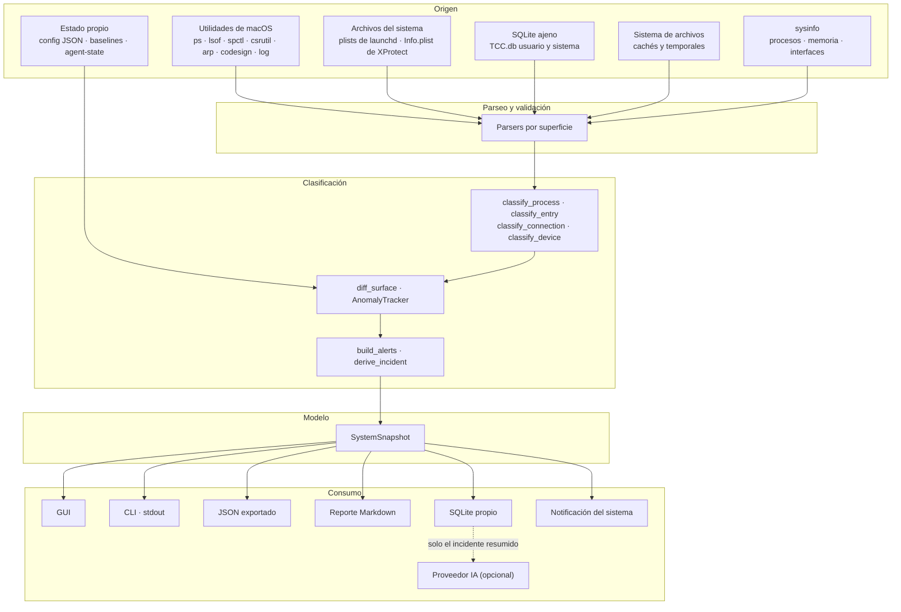
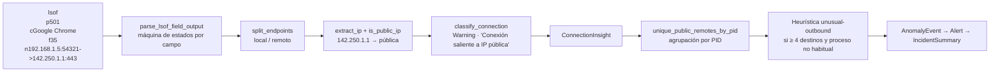
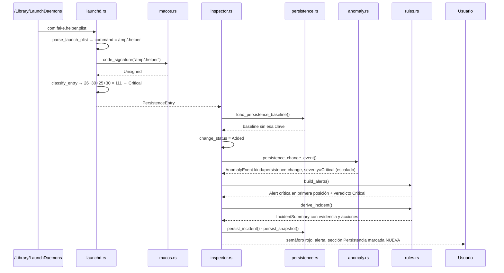

# 08 · Flujo de datos

> De dónde sale cada dato, cómo se valida, en qué se transforma, dónde se guarda, quién lo
> consume y dónde puede perderse o quedar incompleto.

---

## 1. Vista general

La forma del grafo es la tesis del producto: **muchos orígenes, un solo modelo, muchas
salidas**. Nada consume datos del sistema saltándose el modelo.

## 2. Origen de los datos

| # | Origen | Mecanismo | Módulo | Frecuencia |
|---|---|---|---|---|
| 1 | Procesos, memoria, CPU, interfaces | Biblioteca `sysinfo` | `inspector.rs` | Cada captura |
| 2 | Usuario y línea de comandos por PID | `ps -axo pid=,user=,command=` | `macos.rs` | Cada captura |
| 3 | Conexiones de red | `lsof -i -n -P -FpcLftPnT` | `macos.rs` → `network.rs` | Cada captura |
| 4 | Firma de código | `codesign -dvv <ruta>` | `macos.rs` | Hasta 12 rutas por captura |
| 5 | Persistencia | Lectura de `.plist` + `crontab -l` | `launchd.rs` | Cada captura |
| 6 | Login items | `osascript` → System Events | `launchd.rs` | **Solo bajo petición** |
| 7 | Controles de seguridad | `spctl`, `csrutil`, `fdesetup`, `socketfilterfw`, `defaults`, `launchctl` | `security.rs` | Cada captura |
| 8 | Definiciones antimalware | Lectura de 4 `Info.plist` | `security.rs` | Cada captura |
| 9 | Permisos de privacidad | SQLite en solo lectura sobre dos `TCC.db` | `tcc.rs` | Cada captura |
| 10 | Vecinos de red | `arp -a -n`, `route`, `ifconfig` | `netscan.rs` | Cada captura |
| 11 | Barrido activo | 254 × `ping` + `dscacheutil` | `macos.rs` | **Solo bajo petición** |
| 12 | Cachés y temporales | `WalkDir` sobre 7 raíces + `$TMPDIR` | `temp_scan.rs` | Cada captura |
| 13 | Eventos de seguridad | `log show --predicate …` | `macos.rs` | **Solo bajo petición** |
| 14 | Servicios de launchd | `launchctl list` | `launchd.rs` | Cada captura |
| 15 | Configuración | JSON local | `config.rs` | Al arrancar y al guardar |
| 16 | Baselines | SQLite propio | `persistence.rs` | Cada captura |
| 17 | Estado del agente | JSON local | `resilience.rs` | Al arrancar y en cada latido |

## 3. Validación

El producto **no valida entradas de usuario** en el sentido clásico —no hay formularios ni
API—, pero sí valida sistemáticamente lo que le devuelve el sistema operativo. Cinco
técnicas, todas presentes en el código:

| Técnica | Ejemplo | Efecto de un dato malo |
|---|---|---|
| Parseo tolerante con guardas | `let Ok(pid) = pid_text.parse() else { continue }` | Se salta esa línea |
| Descarte explícito de ruido | `(incomplete)` y `ff:ff:ff:ff:ff:ff` en ARP | La entrada no se crea |
| Detección de esquema | `PRAGMA table_info(access)` en TCC | Se usa la columna correcta |
| Normalización antes de comparar | `normalize_mac`, `to_ascii_lowercase` | Evita falsos cambios |
| Valor por defecto seguro | `CodeSignature::Unknown`, `Severity::Warning` para «desconocido» | Nunca se asume confianza |

Validación de la configuración: `serde` con `#[serde(default = "…")]` en cada campo. Un JSON
parcial es válido; uno malformado hace que se usen los valores por defecto **y** se genere
una advertencia visible.

Lo que **no** se valida:

- Rangos de los umbrales configurados. Nada impide poner `cpu_warning_percent = 500`; la
  consecuencia es que esa señal nunca dispara. `INFERENCIA`.
- Banderas desconocidas del CLI: se ignoran en silencio.
- La respuesta del proveedor IA se valida estructuralmente (forma esperada), pero su
  contenido es texto libre generado por un modelo.

## 4. Transformaciones

### 4.1 Cadena típica de un dato

Tomemos una conexión de red, de punta a punta:

Seis transformaciones desde una línea de texto hasta un incidente con evidencia. Ninguna
vuelve a consultar el sistema.

### 4.2 Catálogo de transformaciones

| Dato de origen | Transformación | Resultado |
|---|---|---|
| Bytes acumulados de E/S por PID | Resta contra la muestra anterior con `saturating_sub`; primera muestra siembra | MB del intervalo |
| Bytes de memoria | `/ 1024³` | GB |
| Salida de `codesign` | `classify_codesign_output` | `CodeSignature` |
| Diccionario de un plist | `Program` + `ProgramArguments` según la semántica de launchd | Comando efectivo |
| `auth_value` de TCC | `decode_decision` | `(texto, concedido)` |
| Epoch de TCC | `format_epoch` | RFC 3339 o cadena vacía |
| MAC `0:11:22:…` | `normalize_mac` | `00:11:22:…` |
| IPv4 | `subnet_prefix_of` | Prefijo `/24` |
| Prefijo de MAC | `vendor_from_mac` sobre 26 OUI | Fabricante o vacío |
| Fecha de un bundle | `(ahora − fecha).num_days().max(0)` | Antigüedad en días |
| Bytes de un árbol de directorios | `measure_directory` con tope | MB, nº de archivos, `truncated` |
| Métricas de proceso + firma | `classify_process` | Severidad, puntaje, motivos, categoría |
| Entrada de persistencia | `classify_entry` | `RiskLevel` y nota explicativa |
| Superficie completa | `*_watch_items` | `Vec<WatchedItem>` |
| `WatchedItem` + baseline | `diff_surface` | `PersistenceChange` |
| Cambios + heurísticas | `build_alerts` | Alertas ordenadas y veredicto |
| Captura completa | `derive_incident` | `IncidentSummary` o `None` |
| Captura completa | `build_report` | Markdown de 11 secciones |
| Captura completa | `serde_json` | JSON exportable |
| Captura completa | `persist_snapshot` | Fila compacta en SQLite |

### 4.3 Pérdida de información deliberada

Cada transformación descarta algo, y conviene saber qué:

| Se pierde | Dónde | Por qué |
|---|---|---|
| Salida cruda completa de los comandos | Tras el parseo | Solo se guarda la primera línea útil como evidencia |
| Procesos no destacados | Al persistir | `snapshots` guarda solo el proceso dominante |
| Alertas más allá de `max_alerts` | `build_alerts` | Se truncan tras ordenar por severidad |
| Anomalías más allá de 5 | `derive_incident` | `anomaly_events` guarda las cinco primeras |
| Conexiones más allá de 80 | Solo en la impresión del CLI | La captura las conserva todas |
| Entradas de caché más allá de 40 000 por raíz | `measure_directory` | Se declara como medición aproximada |
| Incidentes duplicados consecutivos | `persist_incident` | Deduplicación por huella |
| Capturas más allá de 1 000 | `trim_table` | Retención configurable |

## 5. Almacenamiento

| Dato | Destino | Duración | Formato |
|---|---|---|---|
| Resumen de captura | Tabla `snapshots` | 1 000 filas | Columnas + `alerts_json` |
| Incidente | Tabla `incidents` | 300 filas | Columnas + `payload_json` |
| Acción manual o de agente | Tabla `audit_log` | Indefinida | Columnas |
| Baseline de persistencia | Tabla `persistence_baseline` | Hasta aceptar otra | Columnas |
| Baselines de seguridad, TCC y red | Tabla `baseline` | Hasta aceptar otra | Columnas |
| Configuración | `rootcause-config.json` | Permanente | JSON |
| Estado del agente | `rootcause-agent-state.json` | Permanente | JSON |
| Captura exportada | `~/Downloads/rootcause-snapshot-<fecha>.json` | La que decida el usuario | JSON |
| Reporte | `~/Documents/RootCause/reports/…md` | La que decida el usuario | Markdown |
| Series de tendencia | Memoria (60 muestras) | Sesión | `Vec<f32>` |
| Caché de firmas y deltas | Memoria | Sesión | `HashMap` |

## 6. Quién consume cada dato

| Consumidor | Qué recibe | Cómo |
|---|---|---|
| Sección Resumen | Veredicto, métricas, tendencias, alertas, salud del agente | `SystemSnapshot` completo |
| Sección Procesos | `processes`, filtrado por texto y severidad | Clonado del snapshot |
| Sección Conexiones | `connections` | Idem |
| Sección Red | `network` y, si se pidió, el escaneo profundo aparte | `NetworkScan` |
| Sección Persistencia | `persistence_entries` + `login_items` bajo demanda | Idem |
| Sección Seguridad | `security_controls` + `xprotect` | Idem |
| Sección Privacidad | `tcc` | Idem |
| Sección Almacenamiento | `caches` | Idem |
| Sección Historial | `history`, `incidents`, `audits`, `events` | Consultas a SQLite bajo demanda |
| CLI | La parte que pida el comando | `SystemSnapshot` o llamada directa al módulo |
| Reporte | Captura completa + hardware | `build_report` |
| Notificación del sistema | Título y detalle de la primera alerta crítica | `macos::notify` |
| Proveedor IA | **Solo** el incidente resumido | `build_payload` |

## 7. Datos que salen del equipo

Este es el apartado corto y el más importante.

| Salida | Ocurre por defecto | Qué contiene |
|---|---|---|
| Petición al proveedor IA | **No.** Requiere `ai.enabled = true`, `ai.endpoint` configurado y la variable de entorno con la clave | Título, tipo, resumen, hipótesis local y evidencia del incidente |
| Cualquier otra | — | **No existe** |

No hay telemetría, ni comprobación de actualizaciones, ni envío de errores, ni analítica, ni
servidor propio. `grep -rn "http" src/` solo devuelve la URL del repositorio en `meta.rs`, el
endpoint configurable de IA y los `unwrap` de `curl` en `ai.rs`.

Lo que **no** viaja en la petición de IA, verificado por el test
`el_payload_solo_lleva_el_incidente_resumido`: la captura completa, la lista de procesos, los
permisos TCC, las rutas de cachés, el inventario de red y el historial.

## 8. Datos personales y sensibles procesados

| Categoría | Ejemplos concretos | Dónde se procesa | Dónde se guarda |
|---|---|---|---|
| Identidad del usuario | Nombre de usuario, UID, nombre del equipo | `macos.rs` | Reporte (nombre de equipo); no en SQLite |
| Software instalado | Rutas de ejecutables, `Label` de plists, bundle ids con permisos | Todas las superficies | `persistence_baseline`, `baseline`, `payload_json` |
| Actividad de red | IP remotas, puertos, IP y MAC de vecinos | `network.rs`, `netscan.rs` | `baseline`, `payload_json` |
| Permisos concedidos | Qué app puede grabar pantalla, leer teclado o el disco entero | `tcc.rs` | `baseline` (solo sensibles concedidos) |
| Contenido de archivos | **Ninguno.** Se leen metadatos y plists de configuración, nunca documentos | — | — |
| Credenciales | **Ninguna.** No se leen llaveros ni almacenes de contraseñas | — | — |

La lista de permisos TCC es probablemente el dato más sensible que el producto maneja: revela
qué aplicaciones pueden observar al usuario. Se guarda solo en la baseline, en local, y nunca
se envía.

## 9. Dónde puede haber pérdidas o inconsistencias

| Punto | Qué puede pasar | Cómo se maneja | Residual |
|---|---|---|---|
| `lsof` sin root | Solo se ven los sockets del propio usuario | El CLI y la GUI lo declaran | Cobertura parcial de conexiones |
| `TCC.db` sin permiso | No hay datos de privacidad | `readable = false` + alerta | Sección vacía, declarada |
| Escaneo ARP pasivo | Solo aparecen equipos con los que ya se habló | Limitación declarada; `--deep` los despierta | Vecinos no vistos |
| Tope de 40 000 entradas | Medición de cachés aproximada | Limitación declarada por raíz truncada | Total infravalorado |
| Presupuesto de 12 firmas | Procesos sin firma resuelta | `signature = None`; no se penaliza | Señal ausente, no falsa |
| Escritura en SQLite falla | La captura no entra al historial | Alerta de advertencia; la captura sí se muestra | Hueco en la serie |
| Configuración inválida | Se usan valores por defecto | Advertencia persistente en cada captura | Umbrales distintos a los esperados |
| Baseline borrada | Todo vuelve a parecer conocido | No hay protección | **Pérdida real de capacidad de detección** |
| Proceso muy corto | Nace y muere entre dos capturas | No se maneja | Invisible para el producto |
| `codesign` sobre binario sustituido | La caché de sesión mantiene la firma anterior | La caché muere con el proceso | Ventana de una sesión |
| Cambio de formato en una utilidad de macOS | El parser deja de reconocer el estado | `known = false` → «Desconocido» en amarillo | Pérdida de dato, no falso verde |

La fila más importante es la penúltima categoría del producto en general: **RootCause solo ve
lo que existe en el momento de la captura**. Un proceso que arranca, escribe y muere en menos
de un intervalo de refresco no aparece en ninguna parte. Es una limitación estructural de un
sensor basado en muestreo, y el producto no la disimula.

## 10. Trazabilidad de un hallazgo

Ejemplo real, seguido por el código: **aparece un LaunchDaemon nuevo que ejecuta un binario
sin firmar desde `/tmp`**.

Cada flecha es una llamada real y comprobable. El puntaje 111 sale de sumar: ámbito
`GlobalDaemon` (26) + ruta temporal (30) + binario oculto (25) + sin firma (30).

---

**Siguiente lectura recomendada:** [09 · APIs e integraciones](09-apis-and-integrations.md).
