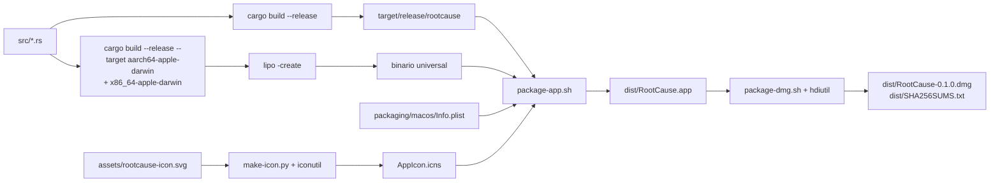

# 13 · Despliegue y operación

> Cómo se construye, se empaqueta, se publica y se opera el producto. Incluye la generación
> de esta documentación en PDF.

---

## 1. Entornos

El producto **no tiene entornos** en el sentido habitual: no hay servidor, ni base de datos
remota, ni configuración por entorno. Lo que sí hay son cuatro contextos de ejecución:

| Contexto | Qué es | Cómo se obtiene |
|---|---|---|
| Desarrollo | Binario compilado localmente | `cargo build` |
| Validación | Ejecución en la CI de GitHub | Automática en cada push a `main` |
| Distribución | `.app` y `.dmg` firmados por nadie | `scripts/package-*.sh` o la release |
| Uso | El Mac del usuario final | Descarga o compilación propia |

## 2. Proceso de construcción



### 2.1 Perfil de release

```toml
[profile.release]
opt-level = 3
lto = true
codegen-units = 1
strip = true
```

`lto` y `codegen-units = 1` alargan la compilación a cambio de un binario más pequeño y
rápido; `strip` elimina los símbolos de depuración, lo que reduce el tamaño y también la
información que un binario distribuido revela sobre el código.

### 2.2 Binario universal

`scripts/package-app.sh --universal` compila para `aarch64-apple-darwin` y
`x86_64-apple-darwin` y los une con `lipo`. Requiere `rustup` (Homebrew solo instala el target
del host). **Si no es posible, no falla**: avisa y se degrada al binario nativo. La CI sí
construye siempre el universal y lo verifica con `lipo -info`.

## 3. Empaquetado

### 3.1 El `.app`

`scripts/package-app.sh` construye la estructura estándar del bundle:

```text
dist/RootCause.app/
└── Contents/
    ├── Info.plist          ← packaging/macos/Info.plist con __VERSION__ sustituido
    ├── MacOS/rootcause     ← binario
    └── Resources/AppIcon.icns
```

`Info.plist` declara `LSMinimumSystemVersion = 13.0`, el identificador
`dev.vladimiracuna.rootcause`, `NSHighResolutionCapable` y `NSAppleEventsUsageDescription`
con el texto que verá el usuario cuando se consulten los login items.

### 3.2 El `.dmg`

`scripts/package-dmg.sh` monta un escenario con el `.app`, un enlace a `/Aplicaciones` y un
`LÉEME.txt` que explica el aviso de Gatekeeper, y crea la imagen con `hdiutil`.

**Detalle operativo importante:** `hdiutil` solo crea imágenes sobre APFS o HFS+. Si el
repositorio vive en un volumen exFAT o de red —habitual en discos externos—, falla con
«Operación no permitida». El script lo evita creando la imagen en un directorio temporal del
disco interno y copiando después el `.dmg`, que es solo un archivo, al destino final.

## 4. Release en un comando

```bash
./scripts/release-product.sh                      # construye dist/ y para ahí
./scripts/release-product.sh --verify-environment # verifica el entorno primero
./scripts/release-product.sh --publish            # además etiqueta y publica
./scripts/release-product.sh --publish --watch    # y espera al workflow
./scripts/release-product.sh --publish --tag-only # empuja el tag; construye la CI
./scripts/release-product.sh --skip-checks        # salta fmt/clippy/tests
```

Siete fases, en este orden:

| Fase | Qué hace | Puede abortar |
|---|---|---|
| 1 · Entorno | `verify-environment.sh` si se pidió | Sí |
| 2 · Validación | `fmt`, `clippy`, `test`, ambas ediciones | Sí |
| 3 · Empaquetado | `.app` universal, `.dmg`, `.zip`, hashes | Sí |
| 4 · Verificación | Que los artefactos existan, no estén vacíos, el binario sea ejecutable y universal, y que **las versiones coincidan** | Sí |
| 5 · Notas | Genera el cuerpo de la release | No |
| 6 · Resumen | Lista lo construido | No |
| 7 · Publicación | Solo con `--publish` | Sí |

La fase 4 comprueba tres coincidencias que suelen fallar en las releases hechas a mano:

1. `lipo -info` contiene `arm64` **y** `x86_64`.
2. `rootcause --version` coincide con la versión de `Cargo.toml`.
3. `CFBundleShortVersionString` del `Info.plist` coincide también.

El comentario del script explica por qué: *un artefacto vacío o ausente que llega a una
release es peor que un fallo de build: nadie lo descubre hasta que alguien intenta usarlo*.

La fase 7 comprueba seis condiciones **antes de tocar el remoto**: binario universal (salvo
`--tag-only`), `gh` instalado, `gh` autenticado, rama `main`, árbol de trabajo limpio,
etiqueta libre y ausencia de una release previa con esa etiqueta.

## 5. Integración y despliegue continuos

### 5.1 `ci.yml`

Disparo: push y pull request a `main`, o manual. Detalle en
[12 · Pruebas y calidad](12-testing-and-quality.md). Publica como artefacto el binario de
release junto con `README.md`, `LICENSE`, `SECURITY.md`, `docs/**` y `scripts/**`.

### 5.2 `release-macos.yml`

Disparo: etiquetas `v*` o manual. Permisos `contents: write`.

1. Toolchain con ambos targets y caché.
2. Valida (`fmt`, `clippy`, `test`).
3. `./scripts/package-app.sh --universal`.
4. **Verifica que el binario es universal** con `lipo -info`.
5. `./scripts/package-dmg.sh`.
6. Comprime el `.app` y añade su hash a `SHA256SUMS.txt`.
7. Lista los artefactos y los sube como artefacto del workflow.
8. Con etiqueta `v*`, crea la release de GitHub con notas generadas y el cuerpo fijo que
   advierte de la falta de firma y notarización.

### 5.3 `deploy-landing.yml`

Disparo: push a `main` que toque `landing/**` o el propio workflow. Publica esa carpeta en
GitHub Pages con concurrencia `pages` y `cancel-in-progress: false`.

## 6. Instalación en el equipo del usuario

| Vía | Pasos | Nota sobre Gatekeeper |
|---|---|---|
| **Compilar** *(recomendada)* | `cargo build --release` | No aplica: el binario es local |
| `.dmg` | Abrir, arrastrar a Aplicaciones | Primera apertura: autorizar en Ajustes → Privacidad y seguridad |
| `.zip` | Descomprimir, mover a Aplicaciones | Igual |
| Homebrew | **No disponible**: el cask es una plantilla sin tap | — |

Los artefactos **no están firmados ni notarizados**, y el cuerpo de la release lo advierte
explícitamente, recomendando compilar desde el código como vía preferente.

## 7. Migraciones

No hay sistema de migraciones. El esquema se crea con `CREATE TABLE IF NOT EXISTS` en cada
arranque, lo que tiene una consecuencia operativa concreta:

| Cambio de esquema | Qué pasa hoy |
|---|---|
| Añadir una tabla | Se crea sola en el siguiente arranque |
| Añadir una columna a una tabla existente | **No se aplica**: la tabla ya existe y no se altera |
| Cambiar un tipo | Idem |

Es decir: cualquier evolución de las tablas existentes exigirá añadir lógica de migración o
documentar el borrado del archivo. Registrado en
[15 · Riesgos](15-risks-and-technical-debt.md).

## 8. Operación diaria

### 8.1 Rutina recomendada

1. Abrir la aplicación y dejarla refrescar; revisar el semáforo y las alertas.
2. En Persistencia, revisar lo marcado como NUEVA o MODIFICADA. Si se reconoce, aceptar la
   baseline; si no, investigar antes de aceptar.
3. En Seguridad, comprobar que los seis controles están en el estado esperado.
4. En Privacidad, revisar los permisos sensibles concedidos.
5. En Red, aceptar la red conocida solo cuando todos los equipos sean identificables.
6. Generar un reporte (`⌘R`) cuando haya algo que documentar.

**La aceptación de baselines es la operación más delicada del producto:** aceptar sin revisar
convierte un hallazgo en estado normal, y a partir de ahí deja de reportarse.

### 8.2 Equivalente en consola

```bash
rootcause status                 # revisión rápida
rootcause persistence            # cambios vs baseline
rootcause persistence --accept   # aceptar tras revisar
rootcause security --accept
rootcause tcc --accept
rootcause network --accept
rootcause report                 # evidencia en Markdown
```

## 9. Logs, métricas y monitoreo

| Aspecto | Estado |
|---|---|
| Archivo de log propio | **No existe**. La salida va a `stdout`/`stderr` |
| Nivel de log configurable | No |
| Métricas | Las que guarda la tabla `snapshots` (CPU, memoria, E/S, cachés) |
| Monitoreo externo | No integrado; se puede construir sobre `--json` |
| Alertas | Notificación del sistema ante alerta crítica |
| Trazas | No |

La ausencia de un archivo de log es coherente con el producto —el historial SQLite cumple ese
papel— pero complica diagnosticar un fallo de arranque, donde el único rastro es lo que se
imprime en la terminal.

## 10. Respaldo y recuperación

| Qué | Cómo | Frecuencia sugerida |
|---|---|---|
| Historial | `rootcause history --backup` | Antes de cualquier cambio importante |
| Todo el estado | Copiar `~/Library/Application Support/RootCauseInspector/` | Antes de actualizar |
| Configuración | Copiar `rootcause-config.json` | Tras ajustarla |
| Reportes | Ya son archivos independientes en `~/Documents/RootCause/reports/` | — |

Recuperación: devolver los archivos a su sitio con la aplicación cerrada. Detalle y
consecuencias en [07 · Base de datos §10](07-database.md).

## 11. Rollback

| Situación | Cómo revertir |
|---|---|
| Versión nueva con problemas | Descargar el `.dmg` anterior de las releases, o `git checkout <tag>` y recompilar |
| Configuración que rompe la detección | Borrar `rootcause-config.json` y ejecutar `config init` |
| Baseline aceptada por error | **No hay deshacer.** Hay que borrar el SQLite (se pierde el historial) o esperar a que el elemento cambie otra vez |
| Limpieza de cachés | **No hay deshacer**; las cachés se regeneran solas |
| Proceso finalizado por error | Volver a lanzarlo manualmente |

La segunda fila es la más relevante para operación: **aceptar una baseline es irreversible**
con las herramientas actuales. Registrado como riesgo.

## 12. Mantenimiento

| Tarea | Frecuencia | Comando |
|---|---|---|
| Actualizar dependencias | Trimestral | `cargo update` + `cargo test` |
| Revisar vulnerabilidades | Mensual | `cargo audit` *(no configurado todavía)* |
| Revisar la CI | Cada release | Pestaña Actions |
| Regenerar la documentación en PDF | Cada cambio en `docs/system-documentation/` | `python3 scripts/build-docs-pdf.py` |
| Revisar el tamaño del SQLite | Semestral | `du -h ~/Library/Application\ Support/RootCauseInspector/` |
| Subir versión | Por release | Editar `Cargo.toml` → `release-product.sh` |

## 13. Generación de la documentación en PDF

### 13.1 Requisitos

```bash
python3 -m pip install markdown xhtml2pdf
```

Ambas son dependencias **solo de documentación**: no forman parte del producto ni de su
compilación.

### 13.2 Uso

```bash
python3 scripts/build-docs-pdf.py               # todos los documentos
python3 scripts/build-docs-pdf.py 07 11         # solo los que empiecen por 07 y 11
python3 scripts/build-docs-pdf.py --check       # solo comprueba dependencias
python3 scripts/build-docs-pdf.py --out RUTA    # directorio de salida alternativo
```

Fuente única: los Markdown de `docs/system-documentation/`. El script **no los edita**: los
lee, los convierte a HTML con una hoja de estilo pensada para papel y los renderiza a PDF en
`docs/system-documentation/pdf/`.

### 13.3 Qué produce

- Un PDF por documento, con portada identificable (sistema, documento, fecha, versión).
- Índice propio en los documentos con cuatro o más encabezados de nivel 2.
- Tablas con tamaño de fuente reducido y partición de palabras largas para que no desborden.

### 13.4 Limitaciones conocidas, deliberadas

| Limitación | Motivo | Mitigación |
|---|---|---|
| Los diagramas Mermaid **no se rasterizan** | El motor de PDF no ejecuta JavaScript | Se incluyen como bloque de código monoespaciado con un aviso: el PDF sigue siendo autocontenido y el diagrama se puede pegar en cualquier visor Mermaid |
| Los enlaces relativos entre documentos no navegan | El PDF es un archivo suelto | Se conservan como texto |
| Tablas muy anchas | Ancho de página fijo | Fuente reducida y partición de palabras |

La alternativa para los diagramas —depender de Node y del CLI de Mermaid— haría el script no
reproducible en un equipo limpio, que es justo lo contrario de lo que se busca en la
documentación de un proyecto sin dependencias.

## 14. Procedimiento de release paso a paso

1. Actualizar `version` en `Cargo.toml`.
2. Actualizar la documentación que cite la versión (`README.md`, portada de esta carpeta).
3. `./scripts/ci-local.sh` → todo en verde.
4. `python3 scripts/build-docs-pdf.py` si cambió la documentación.
5. `git commit` y `git push` a `main`; esperar la CI en verde.
6. `./scripts/release-product.sh` → revisar `dist/`.
7. `./scripts/release-product.sh --publish --watch`.
8. Comprobar la release publicada y descargar el `.dmg` para verificar que abre.

`docs/RELEASE_CHECKLIST.md` mantiene la lista de verificación del producto; este documento
describe la mecánica.

---

**Siguiente lectura recomendada:** [14 · Solución de problemas](14-troubleshooting.md).
